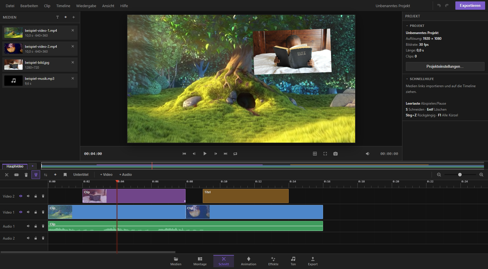

  

# KevCut

**Der Videoeditor, der komplett auf deinem Rechner läuft.** Keine Cloud, kein Abo, keine Uploads – deine Videos bleiben bei dir.

## Download

➡ **[Neueste Version herunterladen](../../releases/latest)** – Installer für Windows (64-Bit).

Bestehende Installationen aktualisieren sich automatisch.

## Was KevCut kann

- **Schnitt**: Mehrspur-Timeline mit Rasierklinge, Trimmen, Gruppieren, verknüpftem Ton, Markern, Übergängen und Titeln
- **Animation**: Keyframes mit Easing, große Preset-Bibliothek, professioneller Keyframe-Editor, Animationsstudio
- **Effekte**: Farbkorrektur, Stil-Effekte (VHS, Glitch, Alter Film …), Masken, Mischmodi, Einstellungsebenen, Greenscreen
- **Ton**: Mixer, Audio-Effekte (EQ, Kompressor, Hall), virtuelle Instrumente, Stimmen-Isolierung, Raumklang bis 7.1
- **KI-Werkzeuge – lokal auf deiner Grafikkarte**: Hochskalieren, Bildraten-Glättung, Hintergrund entfernen, Ton verbessern
- **Export**: MP4/MOV/MP3/WAV/PNG mit Plattform-Vorlagen (YouTube, TikTok, Instagram …), Hardware-Beschleunigung, 5.1-Ton
- **Sicher**: Projekte werden automatisch gespeichert und zusätzlich als Dateien in `Dokumente\KevCut-Sicherungen` gesichert

## Handbuch

| Seite | Beschreibung |
|---|---|
| [Startbildschirm & Projekte](docs/startbildschirm.md) | Projekte anlegen, sichern, wiederherstellen |
| [Medien](docs/medien.md) | Importieren, organisieren, KI-Werkzeuge |
| [Schnitt](docs/schnitt.md) | Timeline, Vorschau, Eigenschaften |
| [Montage](docs/montage.md) | Schneller Rohschnitt mit Drei-Punkt-Schnitt |
| [Animation](docs/animation.md) | Presets und Keyframe-Editor |
| [Effekte](docs/effekte.md) | Effekte, Masken, Mischmodi |
| [Ton](docs/ton.md) | Mixer, Instrumente, Raumklang |
| [Export](docs/export.md) | Formate, Vorlagen, 5.1 |

## Eindrücke

| | |
|---|---|
|  |  |
|  |  |

## Lizenz

KevCut ist proprietäre Software. © 2026 Kevin – alle Rechte vorbehalten.
Die Weitergabe der Installer ist erlaubt; Veränderung, Weiterverkauf und Reverse Engineering sind untersagt.
