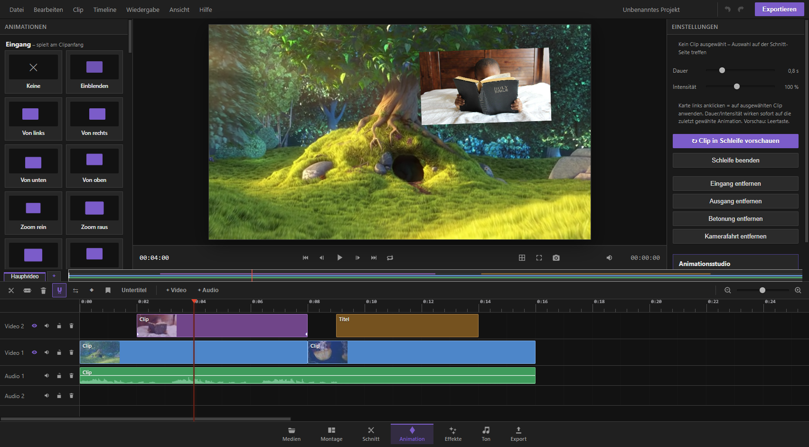

## Was macht die Animations-Seite?

Auf der Animations-Seite gibst du deinen Clips Bewegung: Sie können am Anfang hereinkommen, am Ende wieder verschwinden, sich während des ganzen Clips leicht bewegen (zum Beispiel pulsieren oder wackeln) oder sich wie mit einer Kamerafahrt langsam über das Bild schieben. Dafür gibt es zwei Werkzeuge:

- **Die Bibliothek** – eine grosse Sammlung fertiger Animationen zum Anklicken. Schnell, einfach, für die meisten Fälle völlig ausreichend.
- **Das Animationsstudio** – ein ausführlicher Editor, in dem du Bewegungen Bild für Bild selbst baust: eigene Wege abfahren, Objekte innerhalb eines Clips ausschneiden und einzeln animieren, oder eine fertige Animation von Hand nachjustieren.

Du erreichst die Animations-Seite über die Seiten-Leiste am oberen Rand des Programms.

## Bevor du loslegst: einen Clip auswählen

Animationen wirken immer auf einen Clip, den du **vorher in der Zeitleiste unten anklickst**. Ohne Auswahl bekommst du beim Anklicken einer Animation nur eine Fehlermeldung. Wichtig:

- Nur **Video- und Bildclips** lassen sich animieren. Tonspuren nicht.
- Hast du mehrere Clips zu einer Gruppe zusammengetackert (fest verbunden), wirkt die Animation auf die **ganze Gruppe** wie auf einen einzigen Clip.
- Oben links, unter der Bibliothek beziehungsweise im Konfigurationsbereich rechts, siehst du jederzeit, worauf sich deine nächste Aktion beziehen wird.

## Die Bibliothek: Animationen nach Kategorie

Links auf der Animations-Seite findest du die Bibliothek, gegliedert in vier Kategorien:

- **Eingang** – spielt am Anfang des Clips ab (der Clip kommt zum Beispiel eingeflogen, eingezoomt oder eingedreht herein).
- **Ausgang** – spielt am Ende des Clips ab (der Clip verschwindet entsprechend wieder).
- **Betonung** – wiederholt sich fortlaufend über die ganze Clipdauer. Das sind die kleinen „Lebendig-Effekte“: sanftes Pulsieren, Herzschlag, Wackeln, Schütteln, Wippen, Atmen, Treiben, Erdbeben-Zittern und ähnliches. Genau hier findest du die Wiggle- und Ruhe-Bewegungen, die einem Standbild oder einer ruhigen Aufnahme etwas Leben einhauchen, ohne dass sich die Position dauerhaft verschiebt.
- **Kamerafahrt** – läuft über die komplette Länge des Clips, zum Beispiel ein langsames Heranzoomen oder ein seitliches Schwenken, wie mit einer echten Kamera gefahren.

Zusätzlich gibt es ganz unten den Bereich **Eigene** – dort erscheinen Animationen, die du selbst im Animationsstudio gespeichert hast (siehe weiter unten).

### Eine Animation anwenden

1. Wähle unten in der Zeitleiste den gewünschten Clip aus.
2. Klicke links in der Bibliothek auf eine der Vorschau-Kacheln. Jede Kachel zeigt eine kleine laufende Vorschau der Bewegung, damit du dir vorher ein Bild machen kannst.
3. Die Animation wird sofort auf den Clip angewendet – du siehst das Ergebnis in der geteilten Videovorschau.
4. Über die Kachel **„Keine“** ganz links jeder Kategorie entfernst du die Animation dieser Kategorie wieder vom Clip. Alternativ gibt es dafür unten rechts eigene Knöpfe „… entfernen“ für jede Kategorie.

Du kannst pro Clip **eine Animation je Kategorie** gleichzeitig haben – zum Beispiel einen Eingang **und** eine Betonung **und** einen Ausgang zur selben Zeit. Sie stören sich nicht gegenseitig.

### Dauer und Intensität feinjustieren

Rechts neben der Bibliothek liegt der Konfigurationsbereich mit zwei Reglern:

- **Dauer** – wie lange die Animation dauert (0,2 bis 3 Sekunden, bei Bedarf bis zur vollen Cliplänge). Bei „Betonung“ bestimmt die Dauer die Länge eines Wiederholungs-Zyklus.
- **Intensität** – wie stark die Bewegung ausfällt (20 % bis 200 %). Bei 200 % ist die Auslenkung doppelt so gross wie im Standard, bei 20 % kaum merklich.

Beide Regler wirken **sofort** auf die zuletzt angewendete Animation – du musst sie nicht erneut anklicken. So lässt sich in Echtzeit austesten, wie stark ein Wackeln oder wie lang ein Einflug sein soll.

**Praxis-Tipp:** Für ein dezentes „Idle“-Zittern auf einem sonst ruhigen Bild reicht meist eine Betonung wie „Atmen“ oder „Treiben“ mit niedriger Intensität (etwa 40–60 %) und einer Dauer von 2–3 Sekunden pro Zyklus – wirkt organisch, ohne abzulenken.

### Clip in Schleife vorschauen

Mit dem Knopf **„↻ Clip in Schleife vorschauen“** spielt das Programm genau den Bereich des ausgewählten Clips endlos wiederholt ab. Ideal, um eine Betonungs-Animation oder Kamerafahrt in Ruhe zu beurteilen, während du an den Reglern drehst. Mit **„Schleife beenden“** stoppst du das wieder. Die Leertaste startet und pausiert die Wiedergabe wie gewohnt.

### Eigene Animationen

Ganz unten in der Bibliothek findest du deine gespeicherten eigenen Animationen (angelegt im Animationsstudio, siehe unten). Ein Klick wendet sie wie jede andere Vorlage an; über das kleine „ד auf der Kachel löschst du eine eigene Animation wieder dauerhaft.

## Das Animationsstudio: der grosse Editor

Für alles, was über eine fertige Vorlage hinausgeht, öffnest du das Animationsstudio. Klicke dazu im Konfigurationsbereich auf den Balken **„Animationsstudio“** – oder doppelklicke unten im Clip-Streifen auf einen Clip. Voraussetzung ist wieder ein ausgewählter Video- oder Bildclip.

Das Studio öffnet sich als grosser Arbeitsbereich mit vier Bereichen:

- **Oben** eine Leiste mit allen Video-/Bildclips deines Projekts als kleine Vorschaubildchen – ein Klick wechselt sofort zu einem anderen Clip, ohne das Studio zu schliessen. Clips mit bereits vorhandener Animation zeigen einen Punkt.
- **Links** die Ebenen deines Clips sowie Werkzeuge, um Bereiche im Bild zu markieren.
- **Mitte** die Bühne: eine originalgetreue Vorschau genau des Bildausschnitts, an dem du gerade arbeitest.
- **Rechts** die Vorlagen – dieselbe Bibliothek wie auf der Hauptseite, hier aber anwendbar auf jede einzelne Ebene.
- **Unten** die grosse Zeitleiste mit den Eigenschafts-Spuren, Stoppuhren und Keyframe-Rauten – das Herzstück des Studios.

### Der Clip als Standard-Ebene

Wenn du das Studio öffnest, ist automatisch die Ebene **„Clip“** ausgewählt – du kannst also sofort loslegen, ohne erst etwas anlegen zu müssen. Für diese Ebene stehen fünf Eigenschafts-Spuren bereit:

- **Position** (X und Y zusammen, wie weit der Clip aus der Mitte verschoben ist)
- **Grösse** (in Prozent)
- **Drehung** (in Grad)
- **Deckkraft** (in Prozent, für Ein-/Ausblenden)

Ist der Clip Teil einer getackerten Gruppe, animiert die Clip-Ebene automatisch die **ganze Gruppe** als Einheit – vorhandene Einzel-Animationen der Clips in der Gruppe bleiben davon unberührt und wirken zusätzlich.

### Stoppuhren und Keyframe-Rauten – so funktioniert Keyframe-Animation

Jede Eigenschafts-Zeile in der unteren Zeitleiste beginnt links mit einem kleinen **Stoppuhr-Symbol**:

- Ist die Stoppuhr **aus**, hat die Eigenschaft einen einzigen festen Wert über den ganzen Clip (kein Keyframe nötig). Du kannst den Clip in der Bühne einfach greifen und verschieben, drehen oder an den Ecken skalieren – der neue Wert gilt dann durchgehend.
- Klickst du die Stoppuhr **an**, wird die Eigenschaft animierbar: Es entsteht automatisch je ein Keyframe am Anfang und am Ende des Clips mit dem aktuellen Wert. Ab jetzt kannst du an jeder Stelle der Zeitleiste einen abweichenden Wert festlegen.

Sobald eine Eigenschaft animiert ist, erscheint auf ihrer Spur eine kleine **Raute** (◆) für jeden Keyframe:

- **Anklicken** einer Raute wählt sie aus und springt mit dem Abspielkopf genau auf diese Stelle.
- **Ziehen** einer Raute verschiebt den Zeitpunkt des Keyframes.
- **Rechtsklick** auf eine Raute öffnet ein Menü mit Übergangsarten, Kopieren, Einfügen, Umkehren und Löschen.
- **Doppelklick** auf eine leere Spur setzt an dieser Stelle einen neuen Keyframe.
- Der **Raute-Knopf** neben dem Eigenschaftsnamen (rechts vom Wert) setzt oder entfernt direkt am Abspielkopf einen Keyframe – praktisch, wenn du gerade an der richtigen Bildstelle stehst.
- Die Pfeile ◀ und ▶ daneben springen zum vorherigen beziehungsweise nächsten Keyframe der Eigenschaft.

**So animierst du in der Praxis:** Stoppuhr an → Abspielkopf an den Anfang setzen, Objekt in Position bringen → Abspielkopf weiterschieben, Objekt an die neue Position ziehen (das legt automatisch einen neuen Keyframe an) → wiederholen, bis die Bewegung passt. Genau wie bei professionellen Animationsprogrammen springt beim Ziehen des Clips auf der Bühne automatisch ein Keyframe an der aktuellen Abspielkopf-Position ein, sobald die Stoppuhr der betroffenen Eigenschaft läuft.

Die **Werte** (zum Beispiel „120 px“ oder „45°“) lassen sich auch direkt anklicken und als Zahl eintippen, statt sie auf der Bühne zu ziehen – nützlich für exakte Werte.

### Übergänge (Easing) und die Taste F9

Wie sich ein Wert zwischen zwei Keyframes verändert – ruckartig, gleichmässig oder butterweich – bestimmt der **Übergangstyp** (Easing) des Keyframes. Wähle dazu erst eine Raute aus, dann einen der Knöpfe in der Werkzeugleiste über der Zeitleiste:

- **Easy Ease** (Taste **F9**) – sanfter Start und sanftes Ende, die natürlichste Wahl für die meisten Bewegungen.
- **Ease In** (**Umschalt+F9**) – startet langsam und wird zum Ende hin schneller.
- **Ease Out** (**Strg+F9**) – startet schnell und bremst zum Ende hin ab.
- **Linear** – gleichmässige Geschwindigkeit ohne Beschleunigung, wirkt technisch/roboterhaft.
- **Halten** – der Wert springt hart auf den nächsten Keyframe, ohne Übergang (praktisch für Stop-Motion-artige Sprünge).

Ist gerade kein Keyframe ausgewählt, zeigt die Werkzeugleiste rechts stattdessen den Hinweis „F9 = Easy Ease“ und die Felder für Zeitpunkt, Wert und Übergangsart des gewählten Keyframes, sobald du eine Raute anklickst – dort lässt sich alles auch exakt eintippen.

### Keyframes kopieren, einfügen und umkehren

Über die Werkzeugleiste stehen dir weitere Befehle zur Verfügung:

- **⇄ Umkehren** – spiegelt alle Keyframes einer Eigenschaft zeitlich, aus einem Eingang wird so mit einem Klick ein passender Ausgang.
- **⧉ Kopieren** – kopiert alle Keyframes der ausgewählten Eigenschaft.
- **⎘ Einfügen** – fügt die kopierten Keyframes am Abspielkopf wieder ein (relative Abstände bleiben erhalten).
- **✕ Löschen** – entfernt den ausgewählten Keyframe. Die Entfernen-Taste tut dasselbe.

### Kurvenansicht

Der Knopf **„∿ Kurven“** blendet die Zeitleiste zu einer Kurvenansicht um: Statt einzelner Rauten siehst du den Wertverlauf jeder animierten Eigenschaft als farbige Linie – so erkennst du auf einen Blick, ob eine Bewegung ruckelt oder gleichmässig verläuft.

### Ein Objekt im Bild ausschneiden und einzeln animieren

Neben dem gesamten Clip lassen sich auch **einzelne Bildbereiche** als eigene Ebene herauslösen und unabhängig animieren – zum Beispiel ein Logo, ein Gesicht oder ein Produkt, das sich anders bewegen soll als der Rest des Bildes.

1. Wähle links eines der Werkzeuge:
   - **▭ Rechteck** – ein Rechteck im Bild aufziehen.
   - **◯ Ellipse** – eine ovale Fläche aufziehen.
   - **✎ Lasso** – frei Punkt für Punkt eine Form klicken, mit Doppelklick oder Enter schliessen.
   - **KI-Motiv** – das Hauptmotiv im Bild automatisch freistellen lassen (keine manuelle Markierung nötig).
2. Das markierte Objekt erscheint links als eigene Ebene und ist ab sofort ausgewählt. Es hat dieselben fünf Eigenschafts-Spuren wie der Clip und lässt sich genauso mit Stoppuhr und Keyframes animieren, unabhängig vom restlichen Bild.
3. Über **Modus** entscheidest du, wie das Objekt behandelt wird: **„Ausschneiden“** entfernt es an seiner ursprünglichen Stelle aus dem Bild (und du bewegst nur den ausgeschnittenen Teil), **„Kopie drüber“** legt eine bewegliche Kopie über das unveränderte Originalbild.
4. Mit dem Regler **Kante** lässt sich der Rand des Ausschnitts weichzeichnen, damit der Übergang nicht hart wirkt.
5. Eine Ebene, die du nicht mehr brauchst, entfernst du über das **✕** neben ihrem Namen in der Ebenenliste (oder mit der Entfernen-Taste, wenn sie ausgewählt ist). Mit dem Augen-Symbol schaltest du sie sichtbar/unsichtbar, ohne sie zu löschen.

**Praxis-Tipp:** Für ein einzelnes Logo oder Wasserzeichen, das die ganze Zeit leicht schweben soll, eignet sich am besten „KI-Motiv“ oder ein sauberes Rechteck – anschliessend auf dieser Ebene eine Betonungs-Vorlage wie „Atmen“ oder „Treiben“ mit niedriger Intensität anwenden (siehe nächster Abschnitt), statt jeden Keyframe von Hand zu setzen.

### Vorlagen im Studio anwenden

Die Vorlagen rechts im Studio funktionieren wie auf der Hauptseite, wirken aber gezielt auf die **gerade gewählte Ebene** – also auch auf ein ausgeschnittenes Objekt, nicht nur auf den ganzen Clip. Klicke die gewünschte Kategorie auf, um sie aufzuklappen, und dann eine Vorlage aus der Liste. Über die Felder **Dauer** und **Intensität** direkt darüber stellst du wie auf der Hauptseite die Länge und Stärke ein, bevor du eine Vorlage anklickst.

### Eigene Vorlage speichern

Hast du auf einer Ebene eine Animation gebaut, die dir gefällt, kannst du sie als eigene Vorlage sichern:

1. Wähle die Ebene mit den gewünschten Keyframes.
2. Klicke rechts bei der Kategorie **„Eigene“** auf **„＋ Speichern“**.
3. Vergib einen Namen und wähle, ob es sich um einen Eingang, Ausgang oder eine Betonung handelt.
4. Bestätige mit **„Speichern“**.

Die neue Vorlage taucht ab sofort sowohl im Studio als auch in der Bibliothek der Hauptseite unter „Eigene“ auf und lässt sich auf jeden beliebigen Clip anwenden.

### Effekt-Eigenschaften animieren

Über **„＋ Eigenschaft“** unterhalb der Standard-Spuren (nur auf der Clip-Ebene verfügbar) blendest du zusätzliche Zeilen ein, etwa Weichzeichnen, Helligkeit oder Kontrast. So lässt sich zum Beispiel ein Clip langsam scharf einblenden oder die Helligkeit im Verlauf pulsieren lassen – genau wie bei den Bewegungs-Eigenschaften mit Stoppuhr und Keyframes.

### Wiedergabe und Navigation im Studio

- **Leertaste** – Wiedergabe starten/anhalten.
- **Pfeiltasten links/rechts** – ein Bild zurück beziehungsweise vor.
- Das **Lineal** über den Eigenschafts-Spuren lässt sich anklicken und ziehen, um direkt an eine Stelle im Clip zu springen (Scrubben).
- **Entf/Rücktaste** löscht je nach Auswahl den markierten Keyframe oder die markierte Objekt-Ebene – der Clip selbst wird dabei nie gelöscht.
- **Esc** schliesst eine gerade gezeichnete Lasso-Form beziehungsweise das ganze Studio.

## Zusammenfassung der wichtigsten Tastenkürzel im Studio

| Taste | Wirkung |
|---|---|
| Leertaste | Abspielen/Pausieren |
| ← / → | ein Bild zurück/vor |
| F9 | Easy Ease auf den gewählten Keyframe |
| Umschalt+F9 | Ease In auf den gewählten Keyframe |
| Strg+F9 | Ease Out auf den gewählten Keyframe |
| Entf / Rücktaste | gewählten Keyframe oder gewählte Objekt-Ebene löschen |
| Enter (im Lasso-Werkzeug) | Lasso-Form schliessen |
| Esc | Lasso abbrechen bzw. Studio schliessen |

## Kurz gesagt

- **Schnell etwas Bewegung ins Bild bringen?** Clip auswählen, Bibliothek links auf der Animations-Seite durchstöbern, Kachel anklicken, mit Dauer/Intensität feinjustieren.
- **Ruhiges „Idle“-Wackeln oder -Pulsieren für ein Standbild?** Kategorie „Betonung“ – dort liegen alle Wiggle-artigen Bewegungen wie Atmen, Treiben, Wobbeln oder Herzschlag.
- **Volle Kontrolle, eigene Wege oder einzelne Bildbereiche animieren?** Animationsstudio öffnen, Ebene wählen, Stoppuhr an, Keyframes mit F9 weich abstimmen.
