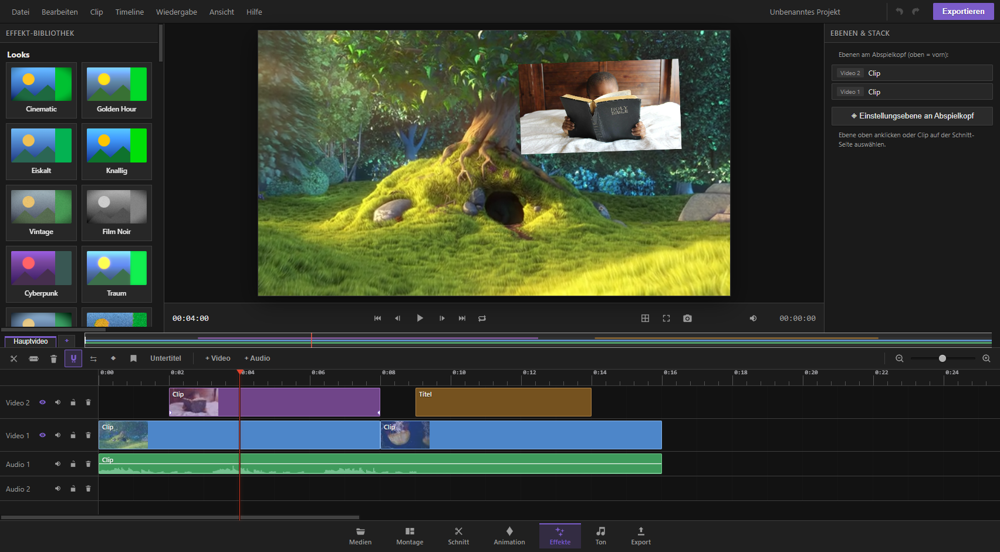

## Was macht die Effekte-Seite?

Auf der Effekte-Seite gibst du deinem Video seinen Look: Farbkorrektur, Stimmung, Stil-Filter, Störungen wie Glitch oder VHS, Wetter- und Partikeleffekte, Freistellen vor Grünhintergrund und vieles mehr. Links findest du die Bibliothek mit allen Effekten und fertigen Looks, in der Mitte läuft die Vorschau deines Projekts, unten die Zeitleiste, und rechts siehst du den Effekt-Stapel der gerade ausgewählten Ebene – also die Liste aller Effekte, die auf diesem Clip liegen, plus Mischmodus und Maske.

Wichtig zu wissen: Effekte wirken immer auf eine ausgewählte Ebene (Clip). Bevor du also einen Effekt anklickst, wähle zuerst den gewünschten Clip aus – entweder auf der Schnitt-Seite oder direkt in der Ebenenliste oben rechts auf der Effekte-Seite.

## Einen Effekt anwenden

1. Wähle einen oder mehrere Clips aus (Mehrfachauswahl möglich – der Effekt landet dann auf allen gleichzeitig).
2. Klicke links in der Bibliothek auf die gewünschte Effekt-Karte.
3. Der Effekt erscheint sofort im Effekt-Stapel rechts und wirkt sofort in der Vorschau.
4. Um die Feineinstellungen (Regler, Farbwähler) zu bearbeiten, wechsle zur Schnitt-Seite: Dort öffnet sich im Inspektor-Bereich rechts derselbe Effekt mit allen Reglern zum Ausprobieren – inklusive der Möglichkeit, jeden Regler über die Zeit zu animieren (Keyframes setzen).

Tipp: Jede Effekt-Karte in der Bibliothek zeigt eine kleine Live-Vorschau, wie der Effekt auf einem Beispielbild aussieht – inklusive einer grünen Fläche, an der du dir den Chroma-Key-Effekt vorstellen kannst.

## Die Effekt-Bibliothek im Überblick

Die Bibliothek ist grob in Grundkorrektur, kreative Stilfilter, Bewegungs-/Störeffekte, Profi-Farbkorrektur und Partikel-Wettereffekte unterteilt. Hier die wichtigsten:

### Grundlegende Bild-Korrektur
- **Helligkeit** – hellt das Bild auf oder ab.
- **Kontrast** – verstärkt oder schwächt den Unterschied zwischen hellen und dunklen Bereichen.
- **Sättigung** – macht Farben kräftiger oder entsättigt sie bis hin zu Graustufen.
- **Farbton drehen** – verschiebt alle Farben gleichmäßig auf dem Farbkreis (schräger, psychedelischer Effekt in hoher Dosis).
- **Weichzeichner** – macht das Bild unscharf, von leichtem Weichzeichnen bis zu starkem Verwischen.
- **Graustufen** – Schwarzweiß-Umwandlung mit regelbarer Stärke.
- **Sepia** – warmer Braunton wie bei alten Fotografien.
- **Invertieren** – kehrt alle Farben ins Negativ um.
- **Schärfen** – betont Kanten, macht das Bild knackiger.

### Kreative Stilfilter
- **Pixelieren** – löst das Bild in grobe Blöcke auf (Zensur-Look, Retro-Grafik).
- **Vignette** – verdunkelt die Bildränder, lenkt den Blick zur Mitte.
- **Farbtemperatur** – macht das Bild wärmer (orange) oder kälter (blau).
- **Posterisieren** – reduziert die Anzahl der Farbabstufungen, wirkt wie ein Comic oder Siebdruck.
- **Duotone** – ersetzt Schatten und Lichter durch zwei frei wählbare Farben (z. B. tiefes Blau und knalliges Pink).
- **Glühen** – lässt helle Bildstellen sanft ausstrahlen, wie durch einen Traum-Filter.
- **Spiegeln** – klappt das Bild horizontal oder vertikal.

### Störungen, Glitch und Retro-Look
- **RGB-Versatz** – verschiebt die Farbkanäle gegeneinander, wie ein schlecht eingestellter alter Fernseher.
- **Glitch** – digitale Bildstörungen und Zeilenversätze, wie ein Signalfehler.
- **Filmkorn** – legt feines Bildrauschen über das Video, wie analoges Filmmaterial.
- **Scanlines** – zeichnet feine horizontale Zeilen wie bei einem Röhrenbildschirm.
- **VHS** – kompletter Videokassetten-Look mit Farbfehlern und Flimmern.
- **Alter Film** – Flimmern und Unruhe wie bei historischem Filmmaterial.
- **Wackeln** – simuliert eine wacklige Handkamera.
- **Lichtbeben** – stoßartige, helle Lichtblitze in frei wählbarer Farbe, wie ein Stromausfall oder Blitzeinschlag.
- **Welle** – verzerrt das Bild in wellenförmigen Verschiebungen, wie unter Wasser.
- **Zoom-Unschärfe** – radialer Bewegungsunschärfe-Effekt von einem wählbaren Zentrum aus, wie ein schneller Kamerazoom.
- **Zersplittern** – zerlegt das Bild in Scherben, die auseinanderfliegen (guter Übergangseffekt).
- **Auflösen** – lässt das Bild körnig verschwinden, mit weicher oder glühender Kante (ebenfalls als Übergang nutzbar).

### Profi-Farbkorrektur
- **Farbkorrektur** (Lumetri-Stil) – das umfangreichste Werkzeug: Belichtung, Kontrast, Lichter, Tiefen, Sättigung, Farbtemperatur und Farbtönung getrennt regelbar, dazu drei Farbräder für Tiefen, Mitten und Lichter – wie in professioneller Schnittsoftware.
- **RGB-Kurven** – öffnet einen Kurven-Editor, in dem du Helligkeit und die drei Farbkanäle einzeln als Kurve formen kannst, für die feinste Kontrolle über Kontrast und Farbstimmung.
- **HSL-Sekundärkorrektur** – wählt eine einzelne Farbe im Bild aus (z. B. nur den blauen Himmel oder nur eine rote Jacke) und verändert nur diese – Farbton, Sättigung und Helligkeit lassen sich separat verschieben, ohne den Rest des Bildes zu berühren. Über den Regler „Maske zeigen" kannst du kontrollieren, welcher Bereich gerade erfasst wird.

### Partikel- und Wettereffekte
Schnee, Regen, Konfetti, Funken, Glitzer und Nebel – jeweils mit Reglern für Dichte, Tempo und Partikelgröße. Praktisch, um Stimmung zu erzeugen oder eine Feier-/Winterszene zu untermalen, ganz ohne zusätzliches Filmmaterial.

## Chroma-Key (Greenscreen freistellen)

Mit dem Effekt **Chroma-Key** entfernst du einen einfarbigen Hintergrund (klassischerweise Grün oder Blau) und machst ihn durchsichtig, sodass darunterliegende Ebenen sichtbar werden.

1. Wähle den Clip mit dem Greenscreen-Hintergrund aus.
2. Füge den Effekt „Chroma-Key" hinzu.
3. Wechsle zur Schnitt-Seite und öffne dort im Inspektor den Effekt: Mit dem Farbfeld „Key-Farbe" wählst du die genaue Hintergrundfarbe (Standard ist ein sattes Grün).
4. Der Regler „Toleranz" bestimmt, wie stark ähnliche Farbtöne mit entfernt werden – zu niedrig lässt Reste des Hintergrunds stehen, zu hoch frisst auch Teile des Motivs an.
5. „Weiche Kante" glättet den Übergang zwischen durchsichtig und sichtbar, damit keine harte, gezackte Kontur entsteht.
6. Lege darunter eine neue Hintergrund-Ebene (Bild, Video oder Farbe) auf einer tieferen Spur ab – sie scheint jetzt durch den freigestellten Bereich hindurch.

Praxis-Tipp: Ein gleichmäßig ausgeleuchteter, faltenfreier Hintergrund ohne Schlagschatten liefert die saubersten Ergebnisse. Bei schwierigem Material hilft zusätzlich eine weiche Maske, um Restflächen am Rand abzudecken.

## Fertige Looks (Ein-Klick-Filter)

Ganz oben in der Bibliothek findest du **Looks**: vorgefertigte Kombinationen mehrerer Effekte, die zusammen eine bestimmte Stimmung erzeugen – etwa „Cinematic", „Golden Hour", „Eiskalt", „Vintage", „Film Noir", „Cyberpunk", „Retro-VHS" oder „Sonnenuntergang". Ein Klick auf eine Look-Karte legt die passende Effekt-Kombination auf die ausgewählten Clips.

- Ein neuer Look ersetzt automatisch den vorher angewendeten Look (du sammelst also keine widersprüchlichen Looks übereinander an).
- Zusätzlich angewendete Einzeleffekte bleiben davon unberührt.
- Über „Look entfernen" verschwindet nur der Look wieder, alle sonstigen Effekte bleiben erhalten.

## Eigene Farb-LUT laden

Falls du eine fertige Farbvorlage (Datei mit der Endung „.cube" oder „.3dl", wie sie z. B. viele Kamerahersteller oder Colorist:innen kostenlos anbieten) besitzt, kannst du sie über „LUT laden…" einlesen. Wähle zuerst den Clip aus, klicke auf den Knopf, wähle die Datei – die Farbvorlage wird sofort angewendet. Die Stärke lässt sich danach im Effekt-Stapel wie ein normaler Effekt regeln, du kannst die LUT also z. B. nur zu 60 % einblenden.

## Messwerkzeuge: Waveform und Vektorskop

Unter „Scopes" siehst du zwei kleine Messanzeigen, die live aus der aktuellen Vorschau berechnet werden:

- Das **Waveform**-Diagramm zeigt die Helligkeitsverteilung deines Bildes von dunkel bis hell – hilfreich, um Über- oder Unterbelichtung objektiv zu erkennen, statt sich nur auf den Bildschirmeindruck zu verlassen.
- Das **Vektorskop** zeigt die Farbverteilung im Bild als Punktwolke; die kleinen Markierungen sind Zielpunkte typischer Hauttöne und Grundfarben. Damit lässt sich zum Beispiel prüfen, ob ein Hautton natürlich bleibt, nachdem du die Farbkorrektur verändert hast.

Diese Werkzeuge verändern nichts am Bild – sie sind reine Kontrollanzeigen für alle, die es genauer wissen wollen.

## Der Effekt-Stapel: mehrere Effekte kombinieren

Jeder Clip kann beliebig viele Effekte gleichzeitig tragen. Rechts im Bereich „Ebenen & Stack" siehst du für die ausgewählte Ebene die komplette Liste:

- **Reihenfolge zählt.** Effekte werden von oben nach unten nacheinander angewendet – wie Schichten übereinander. Ein Weichzeichner vor einer Farbkorrektur sieht anders aus als danach. Mit den Pfeilen ▲ und ▼ neben jedem Eintrag änderst du die Reihenfolge.
- **Ein- und ausschalten**, ohne den Effekt zu löschen: Häkchen vor dem Effektnamen setzen oder entfernen – praktisch, um schnell einen Vorher-Nachher-Vergleich zu machen.
- **Löschen**: Klick auf das Kreuz-Symbol am rechten Rand der Zeile entfernt den Effekt endgültig (inklusive eventuell gesetzter Keyframes für diesen Effekt).
- Die kleine Zahl „x fx" in der Ebenenliste oben zeigt dir auf einen Blick, wie viele Effekte auf einer Ebene liegen.

## Werte anpassen und über die Zeit animieren

Die Effekt-Karte im Stapel zeigt nur Name, Ein/Aus-Häkchen und Reihenfolge. Um die eigentlichen Regler (Stärke, Radius, Farbe usw.) zu bedienen, wechsle zur Schnitt-Seite: Dort erscheint im Inspektor derselbe Effekt mit allen Schiebereglern und – bei Effekten mit Farbwahl wie Duotone, Chroma-Key oder Farbkorrektur – mit Farbfeldern.

Jeder dieser Regler lässt sich zusätzlich animieren: Setze an verschiedenen Stellen der Zeitleiste unterschiedliche Werte, dann blendet KevCut sanft zwischen ihnen über – so kannst du zum Beispiel eine Vignette langsam einblenden lassen oder eine Farbkorrektur im Lauf der Szene verändern.

## Mischmodi

Für jede Bild-, Video-, Text- oder Formebene (nicht für Einstellungsebenen und Ton) lässt sich rechts ein **Mischmodus** wählen. Er bestimmt, wie die Ebene mit dem darunterliegenden Bild verrechnet wird – genau wie in Bildbearbeitungsprogrammen:

- **Normal** – keine Verrechnung, die Ebene liegt einfach obenauf.
- **Multiplizieren** – verdunkelt, gut für Schatten, Rauch oder um weiße Flächen verschwinden zu lassen.
- **Negativ multipliziert (Screen)** – hellt auf, gut für Lichter, Funken, Glühen oder um schwarze Flächen verschwinden zu lassen.
- **Ineinanderkopieren, Weiches Licht, Hartes Licht** – kontrastreiche Mischungen für dramatische Überlagerungen und Textureffekte.
- **Farbig abwedeln / Farbig nachbelichten** – starke, oft sehr farbintensive Kontrastverstärkung.
- **Aufhellen / Abdunkeln** – behält jeweils nur den helleren bzw. dunkleren Pixelwert der beiden Ebenen.
- **Differenz / Ausschluss** – erzeugen invertierte, oft grafisch-experimentelle Farbkombinationen.
- **Farbton, Sättigung, Farbe, Luminanz** – übertragen jeweils nur eine dieser Eigenschaften von der oberen auf die untere Ebene, ohne den Rest zu verändern (Luminanz z. B. behält alle Farben der unteren Ebene, übernimmt aber die Helligkeitsverteilung der oberen).

Mischmodi eignen sich hervorragend, um Lichteffekte, Texturen (Staub, Kratzer, Lichtlecks) oder zweite Videospuren organisch mit dem Hauptbild zu verschmelzen.

## Masken: nur einen Bildbereich bearbeiten

Eine Maske grenzt ein, wo eine Ebene sichtbar ist bzw. wo ihre Effekte wirken. Im Bereich „Maske" rechts wählst du zwischen:

- **Keine** – die ganze Ebene ist normal sichtbar.
- **Rechteck** – ein rechteckiger Ausschnitt.
- **Ellipse** – ein ovaler/runder Ausschnitt.

Nach der Wahl erscheinen Regler für:
- **Mitte X / Mitte Y** – Position der Maske im Bild.
- **Breite / Höhe** – Größe der Maske.
- **Weiche Kante** – wie fließend der Übergang von sichtbar zu unsichtbar verläuft (0 = harte Kante, hohe Werte = sehr weicher Verlauf).
- **Invertieren** – kehrt die Maske um: Statt den Innenbereich zu zeigen, wird er ausgeblendet und der Rest bleibt sichtbar.

### Freie Maskenform (Pfad zeichnen)

Für Formen, die kein Rechteck oder Oval sind – zum Beispiel eine Person, ein Gebäude oder eine unregelmäßige Fläche – gibt es die freie Maskenform. Öffne sie per Rechtsklick auf den Clip in der Zeitleiste und wähle „Maskenpfad zeichnen (frei)…":

1. Klicke direkt in der Vorschau nacheinander Punkte, um eine Umrisslinie zu ziehen. Die Punkte verbinden sich automatisch zu einer geschlossenen Form.
2. Ziehe einen vorhandenen Punkt, um ihn zu verschieben.
3. Halte Alt gedrückt und ziehe an einem Punkt, um daraus eine runde, geschwungene Kurve statt einer geraden Ecke zu formen.
4. Doppelklick auf einen Punkt wechselt zwischen scharfer Ecke und weicher Kurve.
5. Klick auf eine bestehende Kante fügt dort einen neuen Punkt ein, ohne die Form zu verändern.
6. Rechtsklick auf einen Punkt löscht ihn wieder (mindestens drei Punkte müssen erhalten bleiben).
7. Im kleinen Bedienfeld stellst du „Weiche Kante" und „Invertieren" ein, genau wie bei Rechteck und Ellipse.
8. Mit Enter, Esc, „Fertig" oder einem Doppelklick auf die freie Fläche schließt du den Editor.

Die freie Maskenform eignet sich hervorragend, um jemanden aus einem Bild freizustellen, einen Effekt gezielt nur auf ein Objekt zu legen, oder ein Element unsichtbar zu machen, ohne das restliche Bild zu berühren.

## Einstellungsebenen

Eine **Einstellungsebene** ist eine unsichtbare Ebene, deren einziger Zweck es ist, Effekte zu tragen. Sie zeigt selbst kein eigenes Bild, sondern wendet ihre Effekte auf alles an, was auf den Spuren darunter liegt – ideal, um zum Beispiel eine Farbkorrektur oder Vignette über eine ganze Szene mit mehreren Clips gleichzeitig zu legen, statt sie auf jeden Clip einzeln zu wiederholen.

So legst du eine an:
1. Setze den Abspielkopf an die Stelle, an der die Einstellungsebene beginnen soll.
2. Klicke rechts auf „◈ Einstellungsebene an Abspielkopf".
3. KevCut legt eine neue, fünf Sekunden lange Ebene auf einer eigenen Spur oberhalb an und wählt sie automatisch aus.
4. Füge nun ganz normal Effekte aus der Bibliothek hinzu – sie gelten für alle sichtbaren Ebenen darunter.

Verschiebe und kürze/verlängere die Einstellungsebene wie jeden anderen Clip auf der Zeitleiste, um genau festzulegen, für welchen Abschnitt sie wirkt.

## Effekt-Stapel kopieren und einfügen

Statt Effekte, Mischmodus und Maske für jeden Clip einzeln neu einzustellen, kannst du den kompletten Stapel übertragen:

1. Wähle den Clip mit dem fertigen Effekt-Setup aus.
2. Klicke rechts auf „Stack kopieren".
3. Wähle den oder die Clips aus, auf die das Setup übertragen werden soll (auch mehrere gleichzeitig möglich).
4. Klicke auf „Einfügen".

Damit werden Effekte (inklusive aller Reglerwerte), Mischmodus und Maske exakt übernommen – eine große Zeitersparnis, wenn mehrere Clips denselben Look bekommen sollen.

## Übergänge

Ganz unten in der Bibliothek findest du außerdem Übergänge zwischen Clips (Überblendung, Blende zu Schwarz, verschiedene Wisch- und Schiebe-Richtungen, Zoom). Wähle einen Clip aus und klicke bei der gewünschten Übergangsart auf „Eingang" oder „Ausgang", um den Übergang an den Anfang oder das Ende des Clips zu legen. Die Dauer des Übergangs lässt sich rechts im Bereich „Übergänge" in Sekunden einstellen.

## Praxis-Tipps

- **Wenig ist oft mehr.** Zwei bis drei aufeinander abgestimmte Effekte wirken meist überzeugender als ein Dutzend gleichzeitig.
- **Reihenfolge ausprobieren.** Wenn ein kombinierter Look nicht wie erwartet aussieht, probiere die Effekte in anderer Reihenfolge im Stapel – oft liegt genau daran der Unterschied.
- **Erst korrigieren, dann stylen.** Grundkorrekturen wie Belichtung, Kontrast und Weißabgleich (Farbtemperatur) meist zuerst setzen, kreative Filter wie Glitch, Duotone oder Vignette danach – so bleibt die Basis sauber.
- **Looks als Startpunkt nutzen.** Wende einen fertigen Look an und passe danach im Effekt-Stapel einzelne Werte an, statt bei null anzufangen.
- **Bei Chroma-Key**: erst Toleranz grob einstellen, bis der Hintergrund komplett verschwindet, dann die weiche Kante feinjustieren, damit Haare oder Kanten nicht hart wirken.
- **Einstellungsebenen für Konsistenz.** Soll eine ganze Szene denselben Grundlook bekommen, lohnt sich eine Einstellungsebene über allen Clips mehr als das mehrfache Wiederholen derselben Effekte.
- **Stack kopieren spart Zeit** bei Serien gleichartiger Clips (z. B. mehrere Interview-Einstellungen mit derselben Farbkorrektur).
- **Scopes zur Kontrolle**, wenn du dir bei der Belichtung oder den Farben unsicher bist – sie zeigen objektiv, was das Auge manchmal täuscht.
