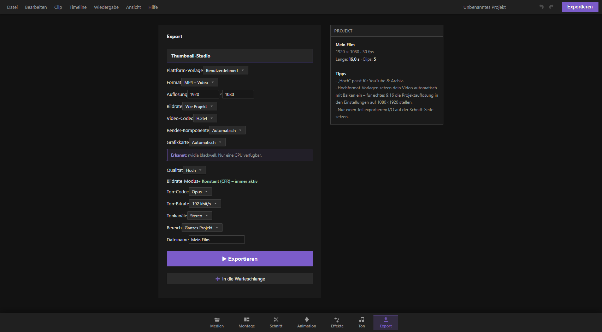

## Was macht die Export-Seite?

Auf der Export-Seite verwandelst du dein fertig geschnittenes Projekt in eine fertige Datei: ein Video zum Hochladen, eine reine Tonspur, ein einzelnes Bild oder eine ganze Bildserie. Du legst hier fest, welches Format herauskommen soll, in welcher Auflösung und Qualität, mit wie vielen Tonkanälen und welcher Teil der Timeline überhaupt exportiert wird. Ein Blick auf die Seite reicht, um zu verstehen, was am Ende in der Datei steckt – nach jedem Export zeigt dir eine Ergebniszeile ehrlich, was tatsächlich geschrieben wurde (Kanäle, Tonverfahren, Lautstärke-Spitze, eventuelle Warnungen).

Du erreichst die Export-Seite über den Reiter „Export" in der unteren Leiste.

## Schnellstart: Dein erstes Video exportieren

1. Wechsle unten zum Reiter „Export".
2. Wähle bei „Format" den Eintrag „MP4 – Video" (das ist bereits voreingestellt).
3. Prüfe Auflösung, Bildrate und Qualität – für die meisten Zwecke reichen die Vorgaben.
4. Gib unten einen Dateinamen ein.
5. Klicke auf „▶ Exportieren".
6. Wähle im erscheinenden Dialog den Speicherort auf deiner Festplatte.
7. Warte, bis der Fortschrittsbalken bei 100 % ankommt – fertig ist deine Videodatei.

Wichtig: Schliesse während des Exports nicht das Programm und lass den Fortschritts-Dialog offen stehen. Einen laufenden Export kannst du jederzeit über den Knopf „Abbrechen" stoppen, ohne dass eine bereits vorhandene Datei am Zielort beschädigt wird.

## Formate im Überblick

Bei „Format" wählst du, was für eine Art Datei entstehen soll:

- **MP4 – Video**: Das universelle Videoformat. Läuft auf praktisch jedem Gerät, jeder Plattform und jedem Player. Für die meisten Zwecke die richtige Wahl.
- **MOV – QuickTime**: Ebenfalls ein Videoformat, technisch dem MP4 sehr ähnlich, aber mit der Kennung für Apple-Programme (etwa für die Weiterverarbeitung in einem anderen Schnittprogramm auf dem Mac). Bei MOV stehen nur die Bildverfahren H.264 und H.265 zur Verfügung.
- **MP3 – nur Ton**: Eine reine, komprimierte Tondatei ohne Bild. Klein, aber verlustbehaftet (kleine Qualitätseinbussen durch die Kompression).
- **WAV – nur Ton (verlustfrei)**: Eine unkomprimierte Tondatei in bestmöglicher Qualität. Deutlich grösser als MP3, aber ohne jeden Qualitätsverlust – ideal, wenn du den Ton noch woanders weiterbearbeiten willst.
- **PNG-Bildsequenz (ZIP)**: Statt eines Videos bekommst du jedes einzelne Bild der Timeline als eigene Bilddatei, alle zusammengepackt in einer ZIP-Datei. Nützlich, wenn du die Bilder einzeln weiterverarbeiten möchtest (etwa für Animationen oder ein anderes Schnittprogramm, das Bildsequenzen einliest). Bildsequenzen sind auf 2000 Einzelbilder begrenzt – bei sehr langen Projekten also den Bereich einschränken oder die Bildrate senken.

Bei den reinen Ton-Formaten (MP3, WAV) und bei der Bildsequenz blendet die Seite automatisch alle Einstellungen aus, die nur für Video gelten (Auflösung, Bildrate-Codec, Render-Komponente und so weiter) – du siehst also immer nur das, was für deine Wahl auch wirklich zutrifft.

## Plattform-Vorlagen: fertige Einstellungen für YouTube, TikTok & Co.

Ganz oben im Formular findest du „Plattform-Vorlage". Damit ersparst du dir das Nachschlagen, welche Auflösung und Bitrate für welche Plattform am besten ist – die Vorlage stellt automatisch Auflösung, Bildrate, Bildverfahren und Ton-Bitrate passend ein und zeigt dir darunter in einer Hinweisbox eine kurze Begründung, warum genau diese Werte gewählt wurden.

Verfügbare Vorlagen:

- **YouTube 1080p (SDR)** – solide Standardauflösung.
- **YouTube 1440p / 2K** – ab dieser Auflösung nutzt YouTube ein schärferes Bildverfahren, das Video wirkt dadurch spürbar knackiger.
- **YouTube 2160p / 4K** – maximale Schärfe, für YouTube besonders geeignet, weil die Plattform hier zuverlässig das beste Bildverfahren einsetzt.
- **YouTube Shorts (9:16)** – Hochformat für Kurzvideos, maximal 3 Minuten.
- **TikTok (9:16, 30 fps)** und **TikTok High-Motion (9:16, 60 fps)** – die 60-fps-Vorlage lohnt sich nur, wenn dein Ausgangsmaterial selbst schon mit 60 Bildern pro Sekunde gedreht wurde.
- **Instagram Reels (9:16)**, **Instagram Feed (4:5)**, **Instagram Story (9:16)**.
- **X / Twitter (16:9, 1080p)** – hier ist ausdrücklich H.264 Pflicht, die Vorlage stellt das automatisch sicher.
- **Facebook Feed (16:9, 1080p)** und **Facebook Reels/Stories (9:16)**.
- **LinkedIn (16:9, 1080p)** – akzeptiert ausschliesslich MP4/H.264.
- **♪ Nur Ton – MP3 320** und **♪ Nur Ton – WAV (verlustfrei)** – falls du von der Video- direkt zur Ton-Vorlage wechseln willst.

Praxis-Tipp: Wenn dein Projekt selbst schon im Hochformat angelegt ist (zum Beispiel 1080×1920 für Instagram und TikTok), passen die Hochformat-Vorlagen perfekt. Ist dein Projekt dagegen im klassischen Breitformat (16:9) angelegt und du wählst eine Hochformat-Vorlage, setzt KevCut dein Bild automatisch mittig ein und lässt links und rechts (oder oben und unten) schwarze Balken stehen, statt das Bild zu verzerren. Willst du stattdessen ein echtes, bildfüllendes Hochformat-Video, musst du bereits die Projektauflösung in den Projekteinstellungen auf 1080×1920 stellen, bevor du schneidest.

Wählst du „Benutzerdefiniert", kannst du alle Werte frei selbst einstellen.

## Auflösung, Bildrate und Qualität von Hand einstellen

- **Auflösung**: Breite × Höhe in Bildpunkten. Voreingestellt ist die Projektauflösung. Du kannst hier auch herunter- oder hochskalieren, etwa ein in 4K geschnittenes Projekt für eine kleinere Zieldatei in Full-HD exportieren.
- **Bildrate**: Wie viele Einzelbilder pro Sekunde die fertige Datei hat. „Wie Projekt" übernimmt die im Projekt eingestellte Bildrate, oder du wählst fest 24, 25, 30, 50 oder 60 Bilder pro Sekunde.
- **Qualität**: Eine bequeme Voreinstellung für die Bildschärfe/Dateigrösse – „Niedrig" ergibt eine kleine, aber weichere Datei, „Sehr hoch" eine grosse Datei mit maximaler Schärfe. Für die meisten Zwecke passt „Hoch". Wählst du „Eigene Bitrate…", kannst du die Video-Bitrate in kbit/s selbst eingeben – je höher die Zahl, desto schärfer und grösser die Datei.
- **Bildrate-Modus**: Steht fest auf „Konstant (CFR)" und ist nicht veränderbar. Das bedeutet, dass jedes Bild exakt im gleichen zeitlichen Abstand geschrieben wird – wichtig, weil viele Plattformen (besonders TikTok und Instagram) Videos mit schwankender Bildrate nach dem Hochladen schlechter oder fehlerhaft verarbeiten.

## Bildverfahren (Video-Codec) und Render-Komponente

Bei „Video-Codec" wählst du das technische Bildverfahren, mit dem die Bildinformationen komprimiert werden:

- **H.264**: Der Klassiker. Wird von praktisch jedem Gerät und jeder Plattform verstanden – die sicherste Wahl.
- **H.265 / HEVC**: Moderneres Verfahren, das bei gleicher Dateigrösse schärfer wirkt (oder bei gleicher Schärfe kleinere Dateien ergibt). Wird nicht von jedem Programm unterstützt.
- **VP9**: Ein von Google entwickeltes Verfahren, das YouTube ab 1440p ohnehin selbst einsetzt.
- **AV1**: Das neueste und effizienteste Verfahren, aber noch nicht überall unterstützt.

KevCut prüft beim Öffnen der Seite automatisch, welche dieser Verfahren dein Rechner tatsächlich beherrscht, und markiert nicht verfügbare Optionen als „nicht verfügbar". Für das Format MOV stehen ohnehin nur H.264 und H.265 zur Wahl, weil dieses Behälterformat keine anderen Verfahren zulässt.

Bei „Render-Komponente" bestimmst du, welcher Teil deines Rechners die Bildberechnung übernimmt:

- **Automatisch**: KevCut entscheidet selbst.
- **Hardware (Grafikkarte)**: Die Berechnung läuft über einen speziellen Baustein deiner Grafikkarte. Das ist deutlich schneller als über den Prozessor, kann aber je nach Grafikkarte in der Bildqualität minimal hinter der Software-Berechnung zurückbleiben.
- **Software (Prozessor)**: Die Berechnung läuft komplett über den Hauptprozessor. Langsamer, dafür meist die höchste erreichbare Bildqualität bei gleicher Bitrate.

Findet ein von dir gewähltes Bildverfahren keine passende Hardware-Berechnung, weicht KevCut automatisch auf die automatische Einstellung aus, statt den Export scheitern zu lassen.

### Grafikkarten-Wahl

Hat dein Rechner mehrere Grafikkarten (zum Beispiel eine im Prozessor eingebaute und zusätzlich eine separate, leistungsstärkere Karte), erscheint das Feld „Grafikkarte" mit einer Liste der erkannten Karten. „Automatisch" überlässt die Wahl dem System. Diese Auswahl wirkt sofort auf die KI-Werkzeuge (etwa Hochskalieren oder Freistellen) auf den anderen Seiten. Für den Video-Export selbst greift die gewählte Karte erst ab dem nächsten Start des Programms – bis dahin entscheidet die Windows-Grafikeinstellung, welche Karte diese eine App benutzt. Ist nur eine Grafikkarte vorhanden oder wurde keine WebGPU-fähige Karte erkannt, bleibt das Feld verborgen und ein Hinweistext erklärt das.

## Ton-Einstellungen

- **Ton-Codec**: AAC (weit verbreitet, kompatibel mit fast allem) oder Opus (moderneres Verfahren, etwas effizienter, aber nicht von jedem Gerät wiedergebbar). Nicht verfügbare Verfahren werden ebenfalls automatisch markiert.
- **Ton-Bitrate**: 128, 192 oder 320 kbit/s. Höher bedeutet besserer Klang bei grösserer Datei. 192 kbit/s ist für die meisten Zwecke ein guter Mittelweg, 320 kbit/s empfiehlt sich für Musikvideos oder anspruchsvollen Ton.

## Stereo, 5.1 und 7.1 – Mehrkanalton exportieren

Bei „Tonkanäle" wählst du, wie viele Lautsprecherkanäle die fertige Datei enthalten soll:

- **Stereo**: Die normalen zwei Kanäle (links/rechts) – die richtige Wahl für praktisch alle Alltagszwecke und für alle Online-Plattformen.
- **5.1 (6 Kanäle)**: Kinoähnlicher Surround-Ton mit sechs Lautsprecherkanälen (vorne links, vorne rechts, Mitte, Subwoofer, hinten links, hinten rechts). Sinnvoll, wenn du dein Projekt selbst mit räumlichem Ton angelegt hast oder für die Wiedergabe auf einer Heimkino-Anlage exportierst.
- **7.1 (8 Kanäle)**: Wie 5.1, zusätzlich mit zwei seitlichen Lautsprecherkanälen für noch feinere Ortung.

Wichtige Praxis-Regeln zu Mehrkanalton:

- Ist 5.1 oder 7.1 für die gerade gewählte Kombination aus Format und Rechner nicht herstellbar, ist die Auswahl im Menü gesperrt und mit einer Begründung versehen. KevCut liefert niemals stillschweigend Stereo aus, wenn eigentlich Mehrkanalton gewünscht war – lieber verweigert es den Export mit einer klaren Fehlermeldung.
- **WAV** kann Mehrkanalton immer selbst schreiben – hier ist 5.1 und 7.1 stets möglich.
- **MP3** und die **Bildsequenz** können grundsätzlich nur Stereo. 5.1/7.1 lässt sich hier gar nicht erst auswählen.
- **MP4/MOV mit 5.1 oder 7.1** braucht ein einmalig herunterzuladendes Konvertierungs-Werkzeug (rund 80 MB), weil das im Programm eingebaute Verfahren selbst kein Mehrkanal-AAC beherrscht. Beim ersten Versuch, 5.1 oder 7.1 für ein Video auszuwählen, fragt dich KevCut ausdrücklich, ob dieses Werkzeug jetzt geladen werden soll – ohne deine Zustimmung wird nichts heruntergeladen. Danach steht die Funktion dauerhaft zur Verfügung. Dieses Werkzeug gibt es nur in der Desktop-Version des Programms, nicht im reinen Browser-Betrieb.
- KevCut prüft die Kanalzahl bereits **vor** dem Rechenstart, nicht erst am Ende: Ist zum Beispiel der gewählte In/Out-Bereich für eine 5.1-Mischung zu lang für den verfügbaren Arbeitsspeicher, bekommst du sofort eine Meldung mit der maximal möglichen Länge – statt nach einer Stunde Rechenzeit eine nichtssagende Fehlermeldung.
- Ist der Originalton lauter als möglich, senkt KevCut die Lautstärke der 5.1/7.1-Mischung automatisch minimal ab, um Verzerrungen zu vermeiden, und meldet dir das nach dem Export in der Ergebniszeile in Dezibel.
- In der Ergebniszeile nach dem Export siehst du immer genau, was in der Datei steckt: Anzahl Kanäle, verwendetes Tonverfahren, Abtastrate, ob der Ton aus dem Originalmaterial stammt oder aus Stereo hochgerechnet wurde, sowie die lauteste gemessene Stelle.

## Render-Bereich: Ganzes Projekt oder nur ein Ausschnitt

Bei „Bereich" wählst du, welcher Teil der Timeline exportiert wird:

- **Ganzes Projekt**: Von Anfang bis Ende der Timeline.
- **Nur In-Out-Bereich**: Nur der Abschnitt zwischen den auf der Schnitt-Seite gesetzten In- und Out-Marken. Diese Option erscheint nur, wenn du vorher überhaupt In- und Out-Marken gesetzt hast.

Praxis-Tipp: Willst du nur einen kurzen Ausschnitt zum Testen exportieren (etwa um schnell zu prüfen, wie eine Einstellung wirkt, ohne das ganze Projekt neu zu rechnen), setz auf der Schnitt-Seite kurz In- und Out-Marken um den gewünschten Abschnitt und wechsle dann zur Export-Seite.

## Export-Warteschlange: mehrere Aufträge nacheinander

Willst du dasselbe Projekt in mehreren Formaten oder Auflösungen gleichzeitig exportieren (zum Beispiel einmal in 4K fürs Archiv und einmal in 1080p für YouTube), musst du nicht auf jeden einzelnen Export warten:

1. Stelle die gewünschten Einstellungen ein.
2. Klicke auf „➕ In die Warteschlange" statt auf „▶ Exportieren".
3. Wähle bei Bedarf gleich den Speicherort für diesen Auftrag.
4. Wiederhole das für weitere gewünschte Varianten – ändere zwischendurch einfach die Einstellungen und füge den nächsten Auftrag hinzu.
5. Klicke auf „▶ Warteschlange (Anzahl)", um alle gesammelten Aufträge nacheinander automatisch abzuarbeiten.

Jeder Auftrag in der Liste zeigt seinen Status an: wartend, läuft gerade, fertig oder fehlgeschlagen. Nach jedem fertigen Auftrag steht auch hier eine kurze Ergebniszeile mit den tatsächlichen Ton-Eigenschaften. Über „Erledigte entfernen" räumst du die Liste von bereits abgeschlossenen Aufträgen auf. Ein Klick auf „Abbrechen" während die Warteschlange läuft, stoppt den gesamten Ablauf nach dem gerade laufenden Auftrag.

## Einzelbild exportieren

Möchtest du nur das aktuell in der Vorschau angezeigte Bild als Datei sichern (zum Beispiel als Standbild, Vorschaubild oder für eine Präsentation), brauchst du dafür keinen vollständigen Export-Durchlauf. Diese Funktion speichert exakt das Bild an der aktuellen Abspielposition als PNG-Datei mit Zeitstempel im Dateinamen – so unterscheidest du später leicht mehrere gespeicherte Einzelbilder desselben Projekts voneinander.

## Standard-Ordner für Exporte festlegen

Damit KevCut nicht jedes Mal erneut nach dem Speicherort fragt, kannst du einen Standard-Ordner für Exporte hinterlegen, in dem der Speichern-Dialog künftig automatisch startet. Diese Funktion braucht den Start des Programms über die Desktop-App; im reinen Browser-Betrieb ist sie nicht verfügbar. Einmal gewählt, merkt sich KevCut diesen Ordner dauerhaft.

## Thumbnail-Studio

Über den Knopf „Thumbnail-Studio" oben auf der Export-Seite öffnest du ein eigenes Werkzeug zur Gestaltung eines Vorschaubildes für dein Video, unabhängig vom eigentlichen Video-Export.

## Zusammenfassung der wichtigsten Praxis-Tipps

- Für YouTube reicht in den meisten Fällen die Qualitätsstufe „Hoch"; für ein Archivmaster lieber „Sehr hoch" oder die passende Plattform-Vorlage in höherer Auflösung wählen.
- Vertikale Formate (TikTok, Reels, Shorts, Story) funktionieren am saubersten, wenn schon das Projekt selbst im Hochformat angelegt wurde – sonst entstehen schwarze Balken statt eines bildfüllenden Videos.
- Für eine schnelle Vorschau eines Exports lohnt sich ein kurzer In/Out-Bereich statt des ganzen Projekts.
- WAV eignet sich am besten, wenn der Ton anschliessend noch woanders weiterverarbeitet werden soll; MP3 reicht für die reine Wiedergabe.
- 5.1/7.1 lohnt sich nur, wenn dein Projekt tatsächlich mit räumlichem Ton arbeitet und die Zielwiedergabe (Heimkino, Player) das auch unterstützt – für Online-Plattformen bleibt Stereo die richtige Wahl.
- Bei langen oder mehreren Exporten hilft die Warteschlange, verschiedene Varianten unbeaufsichtigt nacheinander rechnen zu lassen.
