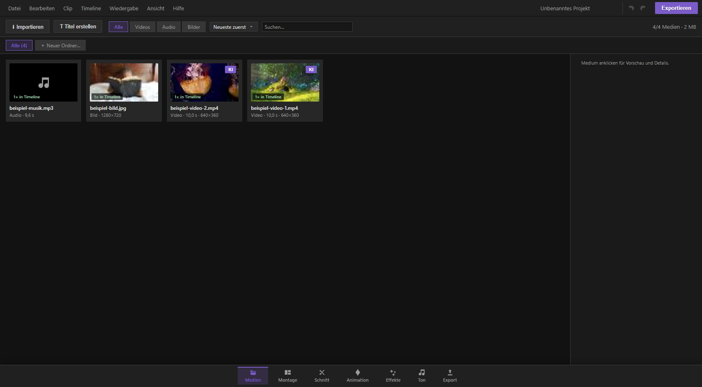

## Was die Medien-Seite ist

Die Medien-Seite ist dein Materiallager: Hier landen alle Videos, Bilder und Töne, die du in deinem Projekt verwenden willst. Von hier aus ziehst du Clips auf die Timeline, sortierst dein Material in Ordner, vergibst Farb-Tags zur Übersicht und rufst KI-Werkzeuge auf, die Videos hochrechnen, glätten, freistellen oder den Ton verbessern. Alles läuft lokal auf deinem Rechner – nichts wird irgendwohin hochgeladen.

Du erreichst die Medien-Seite über die Tab-Leiste unten am Bildschirmrand (erster Reiter).

## Material importieren

Es gibt vier Wege, Dateien in dein Projekt zu holen:

1. **Import-Knopf** – oben links „⬇ Importieren" klicken, Dateien im Auswahldialog markieren.
2. **Datei(en) hineinziehen** – Dateien direkt aus deinem Dateimanager auf das KevCut-Fenster ziehen und loslassen. Ein Overlay zeigt dir währenddessen, dass du gerade über der Ablagezone bist.
3. **Aus der Zwischenablage einfügen (Strg+V)** – praktisch für Screenshots: Kopiere ein Bild (z. B. mit der Windows-Schnipp-Funktion) und drücke irgendwo im Programm Strg+V, solange kein Textfeld aktiv ist. Das Bild wird automatisch mit Zeitstempel benannt und importiert.
4. **Über die Werkzeugleiste des Schnitt-Programms** – der „+"-Knopf oben öffnet denselben Dateidialog.

Beim Import wird jede Datei einmal komplett in eine eigene, sichere Kopie übernommen (bei sehr grossen Dateien siehst du dazu kurz eine Fortschrittsmeldung). Das schützt dich davor, dass eine spätere Änderung oder Löschung der Originaldatei auf der Festplatte dein Projekt zerstört.

### Unterstützte Formate

- **Video:** MP4, MOV, M4V, MKV, WebM, OGV
- **Audio:** MP3, WAV, M4A, AAC, FLAC, Opus, OGG
- **Bilder:** PNG, JPG, WebP, GIF, BMP, AVIF, SVG, ICO

Erkennt das Programm ein Format nicht, meldet es das per Hinweis unten rechts – die Datei wird dann nicht importiert.

**Praxis-Tipp:** Ist eine Datei sehr lang oder sehr hochauflösend (über etwa 4 Minuten oder mehr als 1200 Pixel Höhe) und liegt als MKV, WebM, MP4 oder MOV vor, erstellt KevCut im Hintergrund automatisch eine leichte Vorschau-Kopie in niedrigerer Auflösung (Proxy). Das sorgst du für butterweiches Scrubben in der Timeline, ohne dass dein Export darunter leidet – der Export verwendet immer die Originaldatei in voller Qualität. Diese Umrechnung läuft nur, wenn du gerade nicht abspielst, und pausiert automatisch, sobald du auf Play drückst. Du erkennst den Vorgang an einer Meldung unten rechts; ist er fertig, läuft die Vorschau spürbar flüssiger. Über das Wiedergabe-Menü kannst du diese Funktion bei Bedarf ganz abschalten.

## Die Karten-Ansicht

Jede importierte Datei erscheint als Karte mit Vorschaubild, Namen und kurzen Eckdaten (Typ, Länge bzw. Auflösung, bei Videos zusätzlich die Bildgrösse). Über die Werkzeugleiste kannst du:

- **Suchen** – Namen eintippen, die Liste filtert live.
- **Nach Typ filtern** – Chips „Alle / Videos / Audio / Bilder".
- **Sortieren** – Neueste zuerst, Name A–Z, nach Länge oder nach Dateigrösse.

Unten in der Werkzeugleiste siehst du ausserdem, wie viele Medien insgesamt angezeigt werden und wie viel Speicherplatz dein gesamtes Material belegt.

### Videos: Vorschau beim Drüberfahren (Hover-Scrubbing)

Fährst du mit der Maus über die Miniaturansicht eines Videos, spielt dort eine kleine Live-Vorschau: Bewegst du die Maus horizontal über das Bild, springt das Video an die entsprechende Stelle – so kannst du den Inhalt eines Clips durchsuchen, ohne ihn erst zu öffnen.

### Karten anklicken und mehrfach auswählen

- **Einfacher Klick** wählt eine Karte aus und zeigt rechts das Detail-Panel mit grosser Vorschau.
- **Strg-Klick (oder Cmd-Klick am Mac)** fügt weitere Karten zur Auswahl hinzu oder entfernt sie wieder – so markierst du mehrere Medien gleichzeitig.
- **Doppelklick** hängt das Medium direkt ans Ende der passenden Spur in der Timeline an.
- **Rechtsklick** öffnet ein Kontextmenü mit Farb-Tag, „In Ordner verschieben" und (bei einzelner Auswahl) den Detail-Eigenschaften.

Sobald zwei oder mehr Karten markiert sind, erscheint oben eine Sammel-Leiste mit Aktionen für die ganze Auswahl:

- **Alle ans Timeline-Ende** – hängt alle ausgewählten Medien nacheinander an.
- **Farb-Tag…** – vergibt eine Farbe für die ganze Auswahl auf einmal.
- **Ordner…** – verschiebt die ganze Auswahl in einen Ordner.
- **Entfernen** – löscht alle markierten Medien aus dem Projekt (mit Sicherheitsabfrage).
- Ein kleines „×" hebt die Auswahl wieder auf.

## Medien auf die Timeline bringen

Es gibt mehrere Wege:

1. **Ziehen (Drag & Drop)** – Karte anfassen und auf eine passende Spur in der Timeline ziehen. Während des Ziehens siehst du, welche Spur gerade als Ziel markiert ist; passt die Spurart nicht (z. B. Video auf eine Ton-Spur) oder ist die Spur gesperrt, erscheint eine Fehlermeldung.
2. **Doppelklick** auf die Karte – hängt das Medium automatisch ans Ende der ersten freien passenden Spur an.
3. **Detail-Panel rechts** – nach dem Anklicken einer Karte stehen dort zwei Knöpfe bereit: „Ans Ende der Timeline" und „Am Abspielkopf einfügen" (fügt an der aktuellen Wiedergabeposition ein).
4. **„In Timeline zeigen"** – ist ein Medium bereits mehrfach in der Timeline verwendet, springt dieser Knopf zur ersten Fundstelle und wechselt automatisch zur Schnitt-Seite.

**Praxis-Tipp:** Hat ein Video eine Tonspur, legt KevCut automatisch einen passenden, mit dem Bild verknüpften Ton-Clip auf einer eigenen Tonspur an – du musst dich um die Zuordnung nicht kümmern.

## Ordner (Bins) für mehr Übersicht

Bei grösseren Projekten lohnt es sich, Material in Ordner zu sortieren, ähnlich wie du es aus einem Dateimanager kennst:

- **Ordner-Leiste** direkt unter der Werkzeugleiste zeigt „Alle" (alles ungefiltert) und einen Chip pro angelegtem Ordner samt Anzahl enthaltener Medien.
- **Neuer Ordner…** – legt einen neuen, leeren Ordner an (auch ohne sofort Medien hineinzulegen; er bleibt gemerkt).
- **Karte auf einen Ordner-Chip ziehen** – verschiebt das Medium (oder bei Mehrfachauswahl alle markierten) in diesen Ordner.
- **Karte auf den „Alle"-Chip ziehen** – entfernt das Medium wieder aus seinem Ordner.
- **Rechtsklick auf einen Ordner-Chip** – Umbenennen oder Löschen. Beim Löschen bleiben die enthaltenen Medien im Projekt, sie verlieren nur die Ordnerzuordnung.
- Alternativ über das Kontextmenü einer Karte („In Ordner verschieben →") oder die Sammel-Leiste bei Mehrfachauswahl.

## Farb-Tags

Farb-Tags sind ein schneller visueller Marker, unabhängig von Ordnern – praktisch, um z. B. „bereits geschnitten", „B-Roll" oder „Favoriten" zu kennzeichnen:

1. Karte(n) auswählen (einzeln oder mehrere mit Strg-Klick).
2. Rechtsklick → Farbe wählen (Rot, Orange, Gelb, Grün, Blau, Violett) – oder im Detail-Panel rechts auf „● Farb-Tag…" klicken.
3. „Tag entfernen" nimmt die Markierung wieder weg.

Markierte Karten bekommen einen farbigen Streifen am linken Rand, sodass du sie auf einen Blick im Raster wiederfindest.

## Das Detail-Panel

Klickst du eine einzelne Karte an, öffnet sich rechts ein Panel mit:

- **Grosser Vorschau** – Video mit Abspielsteuerung, Audio mit Wellenform und Abspielleiste, Bild als Vollansicht. Freigestellte Inhalte (transparenter Hintergrund) werden auf einem Schachbrettmuster gezeigt, damit du die Transparenz erkennst.
- **Wellenform** – bei Audio und bei Videos mit Ton siehst du eine kleine Übersicht der Lautstärkeverläufe.
- **Eckdaten** – Typ, Länge, Auflösung, Dateigrösse, ob Ton vorhanden ist, und wie oft das Medium bereits in der Timeline verwendet wird.
- **Aktionsknöpfe:** Ans Ende der Timeline, Am Abspielkopf einfügen, ggf. In Timeline zeigen, Farb-Tag vergeben, Duplizieren (legt eine Kopie im Projekt an), Umbenennen, Aus dem Projekt entfernen.
- Ganz unten die **KI-Werkzeuge**, wenn das Medium sie unterstützt.

**Fehlt eine Datei** (z. B. weil die Originaldatei auf der Festplatte verschoben oder gelöscht wurde), zeigt die Karte ein Warnsymbol „⚠ fehlt" und das Detail-Panel weist dich darauf hin, die Datei über Datei → „Medien neu verknüpfen" wieder zuzuordnen.

## KI-Werkzeuge

Alle KI-Funktionen laufen **lokal auf deiner eigenen Grafikkarte** – es werden keine Dateien ins Internet geschickt. Du findest sie im Detail-Panel, sobald du ein Video, Bild oder Audio anklickst; bei Videos gibt es zusätzlich ein kleines „KI"-Abzeichen direkt auf der Vorschaukachel, das dich schnell dorthin springen lässt.

Läuft bereits eine KI-Aufgabe, siehst du das an einem Hinweis oben im KI-Bereich sowie an einer Fortschrittsanzeige unten rechts – ein zweiter Job startet erst, wenn der erste fertig ist. Du kannst dabei ruhig die Seite wechseln, der Auftrag läuft im Hintergrund weiter.

### Hochskalieren (mehr Auflösung)

Vergrössert Videos oder Bilder auf eine höhere Auflösung – etwa wenn ein altes Handyvideo in 4K exportiert werden soll.

- **Methode wählen:**
  - **GPU-Shader (schnell)** – rechnet in Sekunden bis wenigen Minuten hoch, mit Bildschärfung. Gute Wahl für schnelle Ergebnisse.
  - **KI-Modell (beste Qualität)** – nutzt ein neuronales Netz, das echte Bilddetails hinzuerfindet statt nur zu vergrössern. Dauert länger, sieht aber deutlich sauberer aus, besonders bei starker Vergrösserung.
- **Zielgrösse wählen:** KevCut schlägt passende Auflösungen vor (×1,5 / ×2 / ×3 / ×4 sowie feste Ziele wie Full-HD, QHD, 4K), abhängig von der Ausgangsgrösse.
- Bei Videos mit Ton gibt es zusätzlich das Häkchen **„Bei Upscale/FPS mitanwenden"**, mit dem gleichzeitig auch der Ton verbessert wird.
- Das Ergebnis erscheint als **neues Medium** in deiner Bibliothek (Original bleibt unverändert). Ein Abzeichen „▲ HD" markiert die Karte, wenn ein Hochskalieren-Ergebnis dazu existiert.
- Über den Knopf „↩ … rückgängig" lässt sich das erzeugte Ergebnis jederzeit wieder entfernen.

**Praxis-Tipp:** Für schnelle Vorschauzwecke reicht der GPU-Shader; für den finalen Export lohnt sich das KI-Modell, gerade bei älterem oder verrauschtem Material.

### FPS-Glättung (flüssigere Bewegung)

Erhöht die Bildrate eines Videos künstlich, indem die KI Zwischenbilder berechnet – aus 30 fps können so z. B. 60 fps werden. Das Ergebnis wirkt geschmeidiger, besonders bei Kamerafahrten oder Sport-Aufnahmen.

- Zielbildrate wählen: doppelte Ausgangsrate, feste 60 fps oder 120 fps.
- Auch hier lässt sich der Ton gleichzeitig verbessern (Häkchen).
- Ergebnis landet als eigenes Medium in der Bibliothek, markiert mit „▲ FPS". Rückgängig machen über den entsprechenden Knopf.

**Praxis-Tipp:** FPS-Glättung eignet sich gut für ruhige bis mittelschnelle Bewegungen. Bei sehr schnellen, chaotischen Bewegungen (z. B. Actionsport) können gelegentlich kleine Bildfehler entstehen – am besten kurz Probe schauen, bevor du damit weiterarbeitest.

### Hintergrund entfernen (Freistellen)

Erkennt eine Person im Bild (z. B. bei einer Webcam-/Facecam-Aufnahme) und schneidet automatisch den Hintergrund weg, sodass eine transparente Fläche übrig bleibt – ideal für Overlays über anderes Videomaterial oder Präsentationen.

- **Bei Videos:** funktioniert zuverlässig, wenn eine Person im Bild ist. Ist keine Person zu erkennen, bleibt das Ergebnis schwarz. Für Gegenstände statt Personen gibt es Alternativen direkt in der Timeline (Rechtsklick auf den Clip → Zauberstab-Werkzeug oder Greenscreen-Funktion).
- **Bei Bildern:** ergibt ein PNG mit echter Transparenz.
- Das freigestellte Ergebnis wird als eigenes Medium abgelegt, erkennbar am Abzeichen „✂ Frei". Die Vorschau zeigt es auf einem Schachbrettmuster, damit die Transparenz sichtbar ist.
- Rückgängig machen: Knopf „↩ Freistellen rückgängig".

### Ton verbessern

Verbessert die Sprachverständlichkeit und Lautstärke einer Tonspur automatisch: Lautstärke wird angeglichen (Normalisierung), Stimme klarer herausgearbeitet und ein Kompressor sorgt für gleichmässigeren Pegel.

- **Bei Videos mit Ton:** ein eigener Knopf „▶ Ton dieses Videos verbessern" erzeugt eine neue, verbesserte Ton-Datei (WAV), die als eigenes Medium abgelegt wird – das Originalvideo bleibt unangetastet. Wer stattdessen nur den Ton-Clip in der Timeline direkt bearbeiten will, findet eine gleichwertige Funktion per Rechtsklick auf den Ton-Clip.
- **Bei reinen Audio-Dateien:** derselbe Knopf steht direkt zur Verfügung, das Ergebnis liegt danach ebenfalls als neues WAV in der Bibliothek.
- Ein Abzeichen „♪ +" markiert Medien mit bereits verbessertem Ton.

## Häufige Fragen und Stolpersteine

- **„Warum reagiert das Video beim Import nicht sofort?"** Bei sehr grossen Dateien kopiert KevCut zuerst den kompletten Inhalt lokal, das dauert je nach Dateigrösse einen Moment – ein Fortschrittshinweis erscheint automatisch.
- **„Ich habe eine Datei verschoben oder umbenannt, jetzt fehlt sie."** Über Datei → „Medien neu verknüpfen" der ursprünglichen Karte die (evtl. umbenannte) Datei erneut zuweisen.
- **„Kein Ton beim Import erkannt."** Manche exotischen Formate liefern keinen automatisch lesbaren Ton. In diesem Fall lässt sich der Ton oft trotzdem per Klick manuell aus dem Video extrahieren (Rechtsklick-Option am Clip in der Timeline).
- **„Die Vorschau ruckelt bei grossen Dateien."** Das ist genau der Fall, für den die automatische Proxy-Vorschau gedacht ist – etwas Geduld beim ersten Abspielen, danach läuft es flüssig. Bei Bedarf lässt sich diese Funktion im Wiedergabe-Menü ein- und ausschalten.
- **KI-Ergebnisse verbrauchen zusätzlichen Speicherplatz**, weil sie als eigene Mediendateien angelegt werden. Nicht mehr benötigte Ergebnisse lassen sich jederzeit über „↩ … rückgängig" oder „Aus dem Projekt entfernen" wieder löschen.
