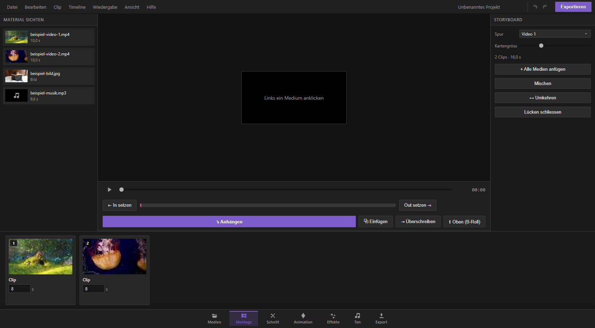

## Wozu die Montage-Seite da ist

Die Montage-Seite ist dein Werkzeug für den ersten groben Zusammenschnitt – den sogenannten Rohschnitt. Hier geht es noch nicht um Feinheiten wie exakte Bild-für-Bild-Trimmung, Farbe oder Effekte, sondern darum, aus deinem Material schnell eine sinnvolle Reihenfolge zu bauen: Welcher Clip kommt zuerst, welcher danach, wie lange soll jeder zu sehen sein.

Der große Unterschied zur Schnitt-Seite: Dort arbeitest du direkt auf der Zeitleiste mit allen Spuren gleichzeitig. Auf der Montage-Seite dagegen sichtest du dein Material zuerst in einem eigenen Vorschau-Fenster (dem Quell-Monitor), wählst dort genau den Abschnitt aus, den du brauchst, und schickst nur diesen Abschnitt in die Zeitleiste. Das ist die klassische Arbeitsweise professioneller Schnittprogramme und eignet sich besonders gut, wenn du viel Rohmaterial hast und erst einmal eine Struktur finden willst, ohne dich in Details zu verlieren.

Die Seite ist in drei Bereiche aufgeteilt:

- **Links:** die Liste all deiner importierten Medien („Material sichten")
- **Mitte:** der Quell-Monitor mit Wiedergabe, In/Out-Markierung und den vier Schnitt-Knöpfen
- **Rechts und unten:** das Storyboard – die Kartenansicht deiner aktuellen Spur

## Material sichten: die Liste links

In der linken Spalte siehst du alle Videos, Bilder und Audiodateien, die du zuvor auf der Medien-Seite importiert hast. Jeder Eintrag zeigt ein kleines Vorschaubild, den Namen und die Länge (bei Bildern steht dort „Bild" statt einer Zeitangabe).

- **Einfacher Klick** auf einen Eintrag lädt ihn in den Quell-Monitor in der Mitte, damit du ihn dir ansehen und einen Ausschnitt festlegen kannst.
- **Doppelklick** lädt das Material *und* hängt es sofort komplett ans Ende deiner aktuellen Spur an – praktisch, wenn du schnell mehrere Clips nacheinander in der bestehenden Reihenfolge grob zusammenwerfen willst, ohne jedes Mal manuell auf „Anhängen" zu klicken.

Ist die Liste leer, hast du noch nichts importiert – das holst du auf der Medien-Seite nach.

## Der Quell-Monitor: dein Sichtungsfenster

Sobald du links ein Material anklickst, erscheint es im großen Vorschaufenster in der Mitte. Bei Videos siehst du das laufende Bild, bei Bildern eine ruhige Standbild-Vorschau.

**Wiedergabe steuern:**

- Der große Knopf unter dem Bild startet und pausiert die Wiedergabe.
- Der Schieberegler daneben zeigt, wo du dich im Material befindest, und lässt dich frei hin- und herspulen – zieh ihn einfach mit der Maus an die gewünschte Stelle.
- Rechts daneben läuft eine Zeitanzeige mit, die dir die aktuelle Position im Zeitcode-Format zeigt.

Wichtig: Der Quell-Monitor zeigt immer nur das *einzelne* Material, das du gerade sichtest – nicht deinen fertigen Film. Das unterscheidet ihn vom Vorschaufenster auf der Schnitt-Seite, das die komplette Zeitleiste zeigt.

## In- und Out-Punkte: der Drei-Punkt-Schnitt

Das Herzstück der Montage-Seite ist die Auswahl eines Ausschnitts aus deinem Rohmaterial. Diese Technik nennt sich Drei-Punkt-Schnitt, weil du mit drei Markierungen arbeitest: dem Startpunkt im Quellmaterial (In), dem Endpunkt im Quellmaterial (Out) und der Stelle in deiner Zeitleiste, an der das Ergebnis landen soll (das ist automatisch dein Abspielkopf).

So gehst du vor:

1. Wähle links ein Material aus und lass es im Quell-Monitor laufen oder spule per Schieberegler an die gewünschte Stelle.
2. Klicke bei der Stelle, an der dein Ausschnitt beginnen soll, auf **„⇤ In setzen"**. Das markiert den Startpunkt.
3. Spule weiter (oder lass das Video laufen) bis zur Stelle, an der der Ausschnitt enden soll, und klicke auf **„Out setzen ⇥"**. Das markiert das Ende.

Unter den beiden Knöpfen erscheint ein schmaler Balken, der deinen gewählten Bereich farblich hervorhebt – so siehst du auf einen Blick, wie groß der markierte Ausschnitt im Verhältnis zum Gesamtmaterial ist. Daneben steht die genaue Länge in Sekunden, zum Beispiel „4,2 s – 9,8 s (5,6 s)".

Ein paar Dinge, die du wissen solltest:

- In- und Out-Punkt können sich nicht überschneiden: Setzt du den Out-Punkt vor den In-Punkt, rückt der In-Punkt automatisch mit nach. Umgekehrt genauso.
- Bei **Bildern** gibt es keinen Ausschnitt im eigentlichen Sinne – hier wird stattdessen automatisch eine Standardlänge von 5 Sekunden vorgeschlagen, die du später direkt auf der Storyboard-Karte anpassen kannst.
- Setzt du gar keine In/Out-Marken, wird beim Einfügen automatisch das komplette Material verwendet.

## Die vier Schnitt-Arten

Hast du deinen Ausschnitt festgelegt, entscheidest du mit einem der vier Knöpfe unter dem Quell-Monitor, *wie* er in deine Zeitleiste wandert. Das sind die vier klassischen Schnitt-Modi, wie sie auch in professionellen Programmen üblich sind:

### ⤵ Anhängen (Append)

Der einfachste und sicherste Modus: Der Ausschnitt wird einfach hinten an das letzte Material auf der aktuell gewählten Spur angehängt, unabhängig davon, wo dein Abspielkopf gerade steht. Nichts Bestehendes wird verändert oder verschoben. Ideal, um zügig eine Kette aus Clips in Reihenfolge aufzubauen.

### ⧉ Einfügen (Insert)

Der Ausschnitt wird genau an der Stelle deines Abspielkopfes eingefügt – und alles, was zeitlich danach kommt (auf *allen* Spuren gleichzeitig, nicht nur der aktuellen), rückt automatisch nach hinten, damit für den neuen Abschnitt Platz entsteht. Das nennt man einen „Ripple"-Schnitt: Es entsteht keine Lücke, aber dein gesamter Film wird ab dieser Stelle um die Länge des neuen Ausschnitts länger. Nützlich, wenn du nachträglich eine Szene mitten in deinen bestehenden Schnitt einschieben willst, ohne die Gesamtstruktur von Hand zu verschieben.

### ⇥ Überschreiben (Overwrite)

Der Ausschnitt wird ebenfalls an der Stelle des Abspielkopfes platziert, aber diesmal legt er sich einfach *über* das, was dort schon liegt – wie eine Aufnahme, die das Vorhandene ersetzt. Clips, die komplett im überschriebenen Bereich liegen, verschwinden; Clips, die nur teilweise betroffen sind, werden entsprechend gekürzt oder sogar in zwei Teile zerschnitten. Die Gesamtlänge deines Films ändert sich dabei nicht. Diesen Modus nutzt du, wenn du z. B. einen Platzhalter-Clip durch das richtige Material ersetzen willst, ohne den Rest der Zeitleiste zu verschieben.

### ⬆ Oben platzieren (B-Roll)

Der Ausschnitt wird nicht auf der gewählten Spur, sondern auf einer neuen Spur *darüber* eingefügt, an der Stelle des Abspielkopfes. Das ist genau der richtige Weg für zusätzliches Bildmaterial, das über einer bestehenden Szene liegen soll – zum Beispiel Einblendungen, Reaktionsbilder oder ergänzende Aufnahmen (sogenanntes B-Roll), während der Hauptclip darunter unangetastet weiterläuft.

Nach jedem der vier Schnitte springt dein Abspielkopf automatisch ans Ende des gerade eingefügten Materials – so kannst du direkt weitermachen und den nächsten Ausschnitt nahtlos anschließen, ohne selbst neu positionieren zu müssen. Eine kurze Meldung unten bestätigt dir jedes Mal, was passiert ist und wie lang der eingefügte Abschnitt war.

**Achtung bei „Überschreiben" und „Einfügen":** Beide arbeiten mit der Position deines Abspielkopfes in der *gesamten Zeitleiste*, nicht mit einer Position im Quellmaterial. Kontrolliere also vor dem Klick kurz, wo der Abspielkopf in deinem Projekt gerade steht – am einfachsten, indem du zuvor kurz auf eine Storyboard-Karte klickst (das setzt den Abspielkopf automatisch an deren Anfang) oder auf der Schnitt-Seite nachschaust.

## Das Storyboard: deine Spur als Kartenreihe

Rechts und unten siehst du das Storyboard: eine Reihe von Karten, die jeweils einen Clip auf der gewählten Spur darstellen. Jede Karte zeigt eine Miniaturansicht, den Namen des Clips, seine laufende Nummer in der Reihenfolge und eine kleine Werkzeugleiste.

### Spur wählen

Ganz oben rechts stellst du über das Auswahlfeld „Spur" ein, welche deiner Video-Spuren du gerade als Storyboard sehen und bearbeiten willst. Alle Aktionen auf dieser Seite – Anhängen, Einfügen, Mischen, Umkehren usw. – beziehen sich immer auf die dort gewählte Spur.

### Kartengröße

Mit dem Regler „Kartengrösse" machst du die Storyboard-Karten größer oder kleiner. Das ist reine Ansichtssache: Bei vielen kurzen Clips lohnt sich eine kleinere Größe, um mehr auf einen Blick zu sehen; bei wenigen längeren Clips darfst du ruhig großzügiger einstellen, um die Vorschaubilder besser erkennen zu können.

### Was jede Karte kann

Jede Karte in der Fußzeile bietet dir direkten Zugriff auf die wichtigsten Werkzeuge, ohne dass du zur Schnitt-Seite wechseln musst:

- **Dauer-Feld:** Trage direkt eine neue Länge in Sekunden ein und bestätige mit Enter oder Klick daneben – die restlichen Karten rücken automatisch lückenlos nach. Bei Videoclips kannst du dabei natürlich nicht länger gehen, als das Ausgangsmaterial hergibt.
- **⇄ Übergang:** Öffnet ein Menü, in dem du einen Übergang zum vorherigen Clip wählst (zum Beispiel eine Überblendung). Ein kleines ⇄-Symbol auf der Karte zeigt dir danach, dass hier ein Übergang aktiv ist.
- **Teilen-Symbol:** Zerschneidet den Clip genau in der Mitte in zwei gleich lange Teile – praktisch, wenn du an dieser Stelle später etwas dazwischenschieben willst.
- **Ton-Symbol** (nur bei Videoclips): Schaltet den Ton dieses einzelnen Clips ein oder aus, ohne den Bildinhalt zu verändern.
- **T (Titel einfügen):** Fügt direkt nach diesem Clip eine dreisekündige Titelkarte ein; alles Nachfolgende rutscht entsprechend weiter.
- **Papierkorb:** Entfernt den Clip vollständig aus der Spur; die Lücke wird automatisch geschlossen.

Ein Klick auf eine Karte wählt den Clip aus und setzt den Abspielkopf an dessen Anfang. Ein Doppelklick tut dasselbe und wechselt zusätzlich direkt zur Schnitt-Seite, falls du dort im Detail weiterarbeiten willst.

### Karten per Ziehen umsortieren

Du kannst jede Karte einfach mit gedrückter Maustaste an eine andere Position ziehen. Während du ziehst, erscheint eine schmale Einfüge-Markierung, die dir zeigt, wo die Karte landen würde. Lässt du los, springt der Clip an die neue Stelle, und alle Clips auf der Spur rücken automatisch lückenlos nach – du musst dich um Lücken oder Überschneidungen nie selbst kümmern.

### Die Werkzeuge in der rechten Leiste

Über dem Storyboard findest du außerdem:

- **„+ Alle Medien anfügen":** Hängt alle Videos und Bilder, die noch nirgends in deiner Zeitleiste verwendet werden, in der Reihenfolge deiner Medien-Liste ans Ende der gewählten Spur an. Praktisch, wenn du einfach erst mal alles grob aneinanderreihen willst, um dann in Ruhe umzusortieren.
- **„Mischen":** Würfelt die Reihenfolge aller Karten auf der Spur zufällig neu durch. Nützlich als Ausgangspunkt für einen Musik- oder Highlight-Zusammenschnitt, bei dem die Reihenfolge noch offen ist.
- **„↔ Umkehren":** Dreht die komplette Reihenfolge der Spur um – der letzte Clip wird zum ersten und umgekehrt.
- **„Lücken schliessen":** Rückt alle Clips auf der Spur bündig aneinander, falls durch vorheriges Löschen oder Verschieben Lücken entstanden sind.

Die Gesamtanzahl der Clips und die Gesamtlänge der Spur werden dir laufend über dem Storyboard angezeigt.

## Typischer Arbeitsablauf für einen schnellen Rohschnitt

Ein bewährter Weg, mit der Montage-Seite zügig von rohem Material zu einer ersten Fassung zu kommen:

1. Importiere dein gesamtes Rohmaterial auf der Medien-Seite.
2. Wechsle zur Montage-Seite und sichte die Clips nacheinander im Quell-Monitor. Notiere dir dabei (im Kopf oder auf Papier), welche Momente du behalten willst.
3. Setze für jeden guten Moment In- und Out-Punkte und klicke auf **„⤵ Anhängen"**, um ihn ans Ende deiner Spur zu hängen. Wiederhole das für alle Ausschnitte, die du grob verwenden willst.
4. Sieh dir das entstandene Storyboard an und ziehe Karten per Maus in die gewünschte Reihenfolge.
5. Passe grobe Längen direkt über die Dauer-Felder der Karten an.
6. Fällt dir ein Clip ein, der noch fehlt, wähle ihn erneut links, setze In/Out und nutze **„⧉ Einfügen"** an der passenden Stelle im Storyboard (Klick auf die Zielkarte setzt den Abspielkopf dorthin) oder **„⇥ Überschreiben"**, um einen Platzhalter zu ersetzen.
7. Willst du eine zusätzliche Bildebene über einer bestehenden Szene, nutze **„⬆ Oben (B-Roll)"**.
8. Ist die grobe Reihenfolge fertig, wechsle zur Schnitt-Seite, um Übergänge, Effekte, Ton und exakte Trimmungen im Detail zu verfeinern.

## Praxis-Tipps

- **Erst grob, dann fein:** Die Montage-Seite ist bewusst für Tempo gebaut. Verkneif dir hier noch die Feinarbeit an einzelnen Bildern – die holst du auf der Schnitt-Seite nach, wo du frameweise trimmen kannst.
- **Immer die richtige Spur im Blick behalten:** Da alle Storyboard-Aktionen sich auf die im Auswahlfeld gewählte Spur beziehen, lohnt sich vor größeren Aktionen (besonders „Mischen" und „Umkehren") ein kurzer Blick, ob wirklich die gewünschte Spur aktiv ist – beide Aktionen lassen sich zwar über Rückgängig (Strg+Z) sofort rückgängig machen, aber ein kurzer Check erspart Verwirrung.
- **Doppelklick als Turbo:** Wenn du ohnehin ganze Clips ohne Ausschnitt verwenden willst, spar dir das Setzen von In/Out – ein Doppelklick in der Materialliste links hängt den kompletten Clip direkt an.
- **B-Roll bewusst einsetzen:** Der Modus „Oben platzieren" legt jedes Mal eine frische, neue Spur an. Für mehrere B-Roll-Ausschnitte hintereinander lohnt es sich, nach dem ersten Einfügen die neu entstandene Spur im Auswahlfeld auszuwählen und von dort aus mit „Anhängen" weiterzumachen, statt jedes Mal wieder „Oben platzieren" zu drücken (das würde sonst für jeden Ausschnitt eine eigene Spur erzeugen).
- **Bilder als Platzhalter:** Wenn du noch nicht weißt, wie lange eine Szene später sein soll, aber schon die Reihenfolge festlegen willst, kannst du auch Standbilder als Platzhalter einbauen und deren Länge jederzeit über das Dauer-Feld der Karte anpassen.
- **Nichts geht verloren:** Jede Aktion auf der Montage-Seite – Schnitt, Verschieben, Löschen, Mischen – lässt sich mit Strg+Z rückgängig und mit Strg+Y wiederherstellen, genau wie überall sonst im Programm. Du kannst also risikofrei ausprobieren.
- **Ton bleibt verknüpft:** Wenn du ein Video mit Ton einfügst, legt das Programm automatisch einen passenden, mit dem Bild verknüpften Tonclip auf einer Audiospur an. Verschiebst oder sortierst du die Bildkarte im Storyboard um, wandert der zugehörige Ton automatisch mit.
