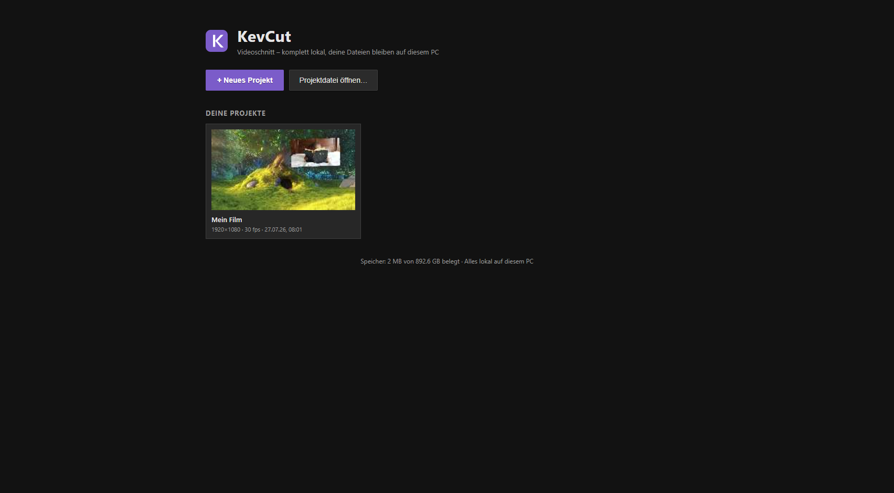

## Was ist der Startbildschirm?

Wenn du KevCut öffnest, siehst du zuerst nicht direkt die Schnittoberfläche, sondern eine Übersicht: den Startbildschirm. Hier legst du neue Projekte an, öffnest bestehende und verwaltest sie. Alles, was du hier siehst, liegt bereits fest auf deinem PC gespeichert – KevCut arbeitet komplett lokal, nichts wird irgendwohin hochgeladen.

Du gelangst jederzeit über das Menü **Datei → „Startbildschirm (Projekte)…“** wieder hierher zurück, auch mitten aus dem Schnitt heraus. Der aktuelle Stand deines Projekts wird dabei automatisch gesichert, bevor die Ansicht wechselt.

## Der Aufbau der Übersicht

Ganz oben stehen zwei große Schaltflächen:

- **„+ Neues Projekt“** – startet ein leeres Projekt und bringt dich direkt in die Schnittoberfläche.
- **„Projektdatei öffnen…“** – öffnet eine zuvor exportierte Projektdatei (Endung `.kcproject`) von deiner Festplatte.

Darunter folgt der Bereich **„Deine Projekte“**: eine Kachel-Übersicht aller Projekte, die du bisher in KevCut angelegt hast. Jede Kachel zeigt:

- ein kleines Vorschaubild (ein Standbild aus deinem letzten Bearbeitungsstand),
- den Projektnamen,
- Bildgröße, Bildrate (fps) und den Zeitpunkt der letzten Speicherung.

Ganz unten in der Fußzeile siehst du, wie viel Speicherplatz deine Projekte auf dem PC belegen – reine Information, du musst dich darum nicht kümmern.

Hast du noch kein Projekt angelegt, steht dort stattdessen ein Hinweistext: „Noch keine gespeicherten Projekte. Leg mit „Neues Projekt“ los – gespeichert wird automatisch.“

## Ein neues Projekt anlegen

1. Klicke auf **„+ Neues Projekt“**.
2. KevCut legt sofort ein leeres Projekt an und wechselt in die Schnittansicht.
3. Ab diesem Moment kümmert sich KevCut selbstständig ums Speichern – du musst nichts weiter tun (siehe Abschnitt „Automatisches Speichern“ unten).

Ein neuer Name lässt sich jederzeit oben im Projektnamen-Feld der Schnittansicht eintragen.

## Ein Projekt öffnen

Klicke einfach auf eine Kachel in der Übersicht. KevCut lädt daraufhin:

1. zuerst die Projektdaten (Schnitte, Spuren, Effekte, Einstellungen),
2. danach alle zugehörigen Medien (Videos, Bilder, Töne) – ein Ladebalken zeigt den Fortschritt.

Ist alles geladen, landest du direkt in der Schnittansicht und kannst weiterarbeiten – als hättest du nie aufgehört. Anders als bei vielen anderen Programmen musst du deine Video- und Bilddateien **nicht neu verknüpfen**: KevCut hat eine eigene Kopie der Medien sicher hinterlegt.

## Ein Projekt umbenennen

1. Fahre mit der Maus über die gewünschte Kachel.
2. Klicke auf das Stift-/Text-Symbol in der Kachel.
3. Gib den neuen Namen ein und bestätige.

Der neue Name erscheint sofort in der Übersicht.

## Ein Projekt löschen

1. Klicke auf das Papierkorb-Symbol in der gewünschten Kachel.
2. Bestätige die Sicherheitsabfrage.

**Achtung:** Das Löschen ist endgültig – das Projekt samt aller darin enthaltenen Medien-Kopien wird dauerhaft aus KevCut entfernt. Deine ursprünglichen Video-/Bilddateien auf der Festplatte sind davon nicht betroffen, nur die Kopie innerhalb von KevCut verschwindet.

## Automatisches Speichern

Du musst in KevCut praktisch nie manuell speichern – KevCut tut das für dich im Hintergrund:

- Während du an einem Projekt arbeitest, speichert KevCut in regelmäßigen Abständen automatisch (voreingestellt alle 25 Sekunden, einstellbar unter **Datei → Einstellungen…**).
- Zusätzlich speichert KevCut kurz nach jeder abgeschlossenen Änderung (z. B. nachdem du eine Einstellung angepasst hast), damit auch bei einem plötzlichen Schließen der App möglichst wenig verloren geht.
- Falls du das automatische Speichern in den Einstellungen ganz abschaltest, kannst du jederzeit selbst speichern über **Datei → „Projekt speichern“** oder mit der Tastenkombination **Strg + S**.

Diese Speicherung liegt fest auf deinem PC in einer internen Programmdatenbank – deshalb siehst du dein Projekt beim nächsten Programmstart sofort wieder in der Übersicht, mit allen Medien, ganz ohne Neu-Verknüpfen.

## Auto-Sicherungen als zusätzliche Datei-Kopien

Neben dem automatischen Speichern in der internen Datenbank legt KevCut zusätzlich in regelmäßigen Abständen (höchstens alle drei Minuten) eine eigenständige Sicherungsdatei deines Projekts an – als zusätzliches Sicherheitsnetz, falls mit der internen Datenbank einmal etwas schiefgehen sollte.

Diese Sicherungen findest du im Ordner:

**Dokumente\KevCut-Sicherungen\<Projektname>\**

Dort liegen die letzten zehn Sicherungsstände jedes Projekts als Dateien mit Zeitstempel im Namen (z. B. `MeinProjekt_2026-07-27-14-30-05.kcproject`). Ist die Zahl von zehn Sicherungen erreicht, wird automatisch die jeweils älteste gelöscht, sobald eine neue hinzukommt – du musst dort also nicht selbst aufräumen.

**Praxis-Tipp:** Solltest du dein Projekt in KevCut versehentlich löschen oder ein Problem mit der internen Datenbank auftreten, kannst du in diesem Ordner nachsehen und die jeweils neueste `.kcproject`-Datei über **Datei → „Projektdatei öffnen…“** wieder in KevCut laden.

## Projektdateien exportieren und öffnen (.kcproject)

Zusätzlich zur automatischen Speicherung kannst du ein Projekt jederzeit von Hand als eigene Datei sichern – zum Beispiel um es weiterzugeben, manuell zu archivieren oder auf einen anderen PC zu übertragen.

**Exportieren:**

1. Menü **Datei → „Projekt als .kcproject exportieren…“**.
2. Wähle im Speicherdialog einen Ort aus (KevCut merkt sich einen Standardordner für Projekte, den du unter **Datei → „Standard-Ordner für Projekte…“** festlegen kannst).
3. Die Datei wird mit der Endung `.kcproject` gespeichert.

**Öffnen:**

1. Menü **Datei → „Projektdatei öffnen…“** (oder Tastenkombination **Strg + O**), oder die Schaltfläche „Projektdatei öffnen…“ direkt auf dem Startbildschirm.
2. Wähle die gewünschte `.kcproject`-Datei aus.
3. KevCut prüft die Datei auf Gültigkeit und lädt sie als neues Projekt – es erscheint danach auch dauerhaft in deiner Projektübersicht.

**Wichtig zu wissen:** Eine `.kcproject`-Datei enthält nur den Schnitt selbst (Spuren, Effekte, Zeitpunkte) – nicht die eigentlichen Video-, Bild- oder Tondateien. Öffnest du eine solche Datei auf einem anderen PC oder nachdem die Originaldateien verschoben wurden, fehlen die Medien zunächst. KevCut erkennt das automatisch und öffnet in diesem Fall gleich den Dialog zum Neu-Verknüpfen (siehe unten).

## Medien neu verknüpfen

Falls KevCut beim Öffnen eines Projekts merkt, dass einzelne Medien fehlen (weil eine `.kcproject`-Datei ohne die zugehörigen Originaldateien geöffnet wurde, oder eine Datei auf der Festplatte verschoben/gelöscht wurde), erscheint automatisch der Dialog **„Medien neu verknüpfen“**. Du erreichst ihn auch jederzeit selbst über **Datei → „Medien neu verknüpfen…“** (dieser Menüpunkt ist nur sichtbar, solange tatsächlich Medien fehlen).

So gehst du vor:

1. In der Liste siehst du alle Medien des Projekts – ein grünes Häkchen bedeutet „vorhanden“, ein rotes Kreuz bedeutet „fehlt“.
2. Klicke auf **„Dateien auswählen…“**.
3. Wähle im Dateidialog die passenden Original-Dateien von deiner Festplatte aus (du kannst mehrere gleichzeitig auswählen).
4. KevCut ordnet die ausgewählten Dateien automatisch anhand des Dateinamens den fehlenden Einträgen zu.
5. Sobald alle Häkchen grün sind, klicke auf **„Fertig“**.

**Praxis-Tipp:** Die Zuordnung funktioniert nur, wenn der Dateiname exakt (oder in Groß-/Kleinschreibung abweichend) mit dem ursprünglichen Namen übereinstimmt. Benenne verschobene Originaldateien also nicht um, wenn du sie später neu verknüpfen willst.

## Medien prüfen und lokal übernehmen

Für den Fall, dass deine Video- oder Bilddateien auf einem externen Datenträger, Netzlaufwerk oder einer eventuell fehlerhaften Festplatte liegen, bietet KevCut zwei Werkzeuge im Menü **Datei**, mit denen du Probleme frühzeitig erkennst und beheben kannst.

### Medien prüfen (vollständig durchlesen)

Über **Datei → „Medien prüfen (vollständig durchlesen)“** liest KevCut alle eingebundenen Medien einmal komplett durch und prüft, ob sie sich vollständig und fehlerfrei öffnen lassen.

- Ist eine Datei beschädigt oder nicht mehr vollständig lesbar (z. B. weil ein USB-Stick einen Fehler hatte), meldet dir KevCut genau, ab welcher ungefähren Stelle (in Prozent und, wenn möglich, in Sekunden) das Problem auftritt.
- Die betroffene Datei wird danach als „fehlend“ markiert, und du kannst sie über „Medien neu verknüpfen…“ ersetzen.

Das ist besonders sinnvoll, bevor du ein wichtiges Projekt exportierst oder abschließt – so stellst du sicher, dass keine deiner Quelldateien im Hintergrund beschädigt ist.

### Medien lokal übernehmen (Reparatur)

Über **Datei → „Medien lokal übernehmen (Reparatur)“** erstellt KevCut von allen eingebundenen Medien eine frische, lokale Kopie neu. Das ist hilfreich, wenn:

- eine Quelldatei auf einem langsamen oder instabilen Laufwerk liegt und der Schnitt dadurch ruckelt oder gelegentlich Aussetzer hat,
- du unsicher bist, ob eine Verbindung zu einem externen Speicherort (USB-Stick, Netzlaufwerk) dauerhaft stabil bleibt.

Nach dem Vorgang meldet dir KevCut, wie viele Medien erfolgreich übernommen wurden und ob dabei welche als beschädigt aufgefallen sind (diese müsstest du dann über „Medien neu verknüpfen…“ ersetzen). Denke danach daran, dein Projekt einmal zu speichern, damit die neu übernommenen Kopien dauerhaft gesichert werden.

**Praxis-Tipp:** Beide Werkzeuge lesen bei größeren Projekten (viele oder lange Videos) spürbar Zeit – ein Fortschrittshinweis zeigt dir währenddessen den Stand an. Am besten in einer Pause laufen lassen und nicht mittendrin die App schließen.

## Häufige Fragen

**Muss ich meine Ordner mit Video-Rohmaterial für KevCut geöffnet lassen?**
Nein. Sobald ein Medium in KevCut importiert wurde, legt das Programm intern eine eigene Kopie an. Du kannst die Originaldatei danach verschieben oder den Datenträger trennen, ohne dass dein Projekt in KevCut kaputtgeht.

**Was passiert, wenn ich KevCut während des Speicherns schließe?**
Die automatische Speicherung läuft im Hintergrund; falls ausnahmsweise ein sehr kurzes Zeitfenster verpasst wird, greifst du notfalls auf die Auto-Sicherungen in „Dokumente\KevCut-Sicherungen“ zurück (siehe oben).

**Wo sehe ich, wie viel Platz meine Projekte belegen?**
In der Fußzeile des Startbildschirms, direkt unter der Projektübersicht.

**Kann ich ein Projekt auf einen anderen PC mitnehmen?**
Ja – exportiere es als `.kcproject`-Datei (Datei → „Projekt als .kcproject exportieren…“), kopiere diese Datei zusammen mit den Original-Medien auf den anderen PC, öffne sie dort in KevCut und verknüpfe die Medien bei Bedarf neu.
