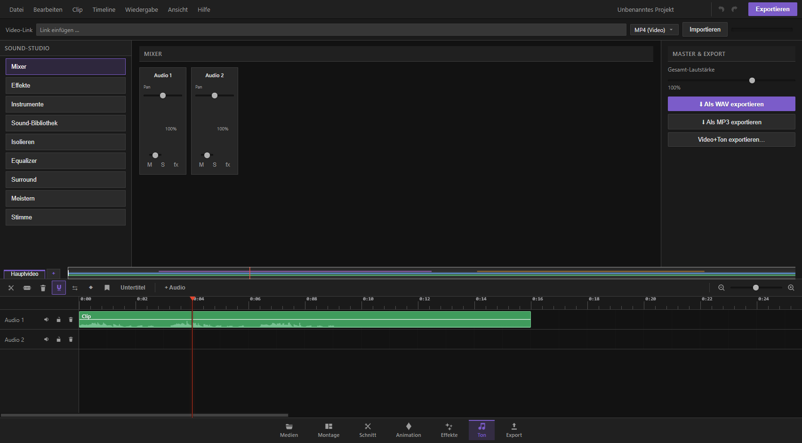

## Was ist die Ton-Seite?

Die Ton-Seite ist dein eingebautes Tonstudio – direkt im Schnittprogramm, mit derselben Zeitleiste wie beim Schneiden, aber nur mit den Tonspuren. Hier mischst du Lautstärken, legst Klangeffekte auf einzelne Spuren, spielst virtuelle Instrumente und Schlagzeug ein, nimmst deine Stimme über das Mikrofon auf, lässt Text vorlesen, trennst Gesang von Musik, feinregelst den Klang mit einem 8-Band-Equalizer, reparierst schlechten Ton (Rauschen, Klicks, zu leise Aufnahmen) und wandelst gewöhnlichen Stereoton in Raumklang (5.1/7.1) um.

Du erreichst die Ton-Seite über die Seitenleiste. Links findest du die Werkzeugauswahl, in der Mitte das jeweilige Werkzeug, rechts der Master-Bereich mit Gesamtlautstärke und Export, unten die geteilte Zeitleiste mit deinen Tonspuren.

## Der Mixer

Der Mixer zeigt für jede Tonspur deines Projekts einen eigenen „Kanalstreifen" – wie an einem echten Mischpult.

Pro Spur stehen dir zur Verfügung:

- **Pan (Stereo-Balance):** Ein Regler, der den Klang zwischen linkem und rechtem Lautsprecher verschiebt. Mittig lässt den Ton gleichmässig aus beiden Boxen kommen, ganz nach links oder rechts gedreht hörst du ihn (fast) nur noch auf einer Seite.
- **Lautstärke-Regler (Fader):** Ein senkrechter Schieberegler von 0 bis 150 %. Damit bestimmst du, wie laut diese Spur im Verhältnis zu den anderen ist. Die Prozentzahl wird direkt daneben angezeigt.
- **Stumm (M):** Schaltet die Spur komplett aus, ohne sie zu löschen. Praktisch, wenn du eine Spur kurz ausblenden willst, um die anderen besser zu hören.
- **Solo (S):** Lässt nur diese Spur hören, alle anderen werden automatisch leise gestellt. Sobald mindestens eine Spur auf Solo steht, werden alle nicht-solo-geschalteten Spuren im Mixer optisch abgedunkelt. So kannst du dich beim Abmischen ganz auf eine Spur konzentrieren.
- **Effekte-Knopf (fx):** Springt direkt zu den Effekten dieser Spur (siehe nächster Abschnitt). Sind bereits Effekte aktiv, leuchtet der Knopf.

Klickst du auf einen Kanalstreifen, wird die Spur ausgewählt – das ist wichtig, weil viele andere Werkzeuge der Ton-Seite (Effekte, Zielspur für neue Aufnahmen) sich auf die zuletzt gewählte Spur beziehen.

**Praxis-Tipp:** Setze beim Feinabmischen zunächst alle Spuren auf eine grobe Lautstärke, dann gehe eine nach der anderen mit Solo durch und höre sie einzeln – so fallen Störgeräusche oder falsches Timing viel schneller auf.

Gibt es noch keine Tonspur, legst du unten in der Zeitleiste eine neue Audiospur an, oder du trennst den Ton eines Videos vom Bild ab.

## Audio-Effekte pro Spur

Unter „Effekte" baust du für jede Tonspur eine eigene Kette von Klangeffekten auf. Effekte wirken sowohl bei der Vorschau als auch später beim fertigen Export – was du hier hörst, bekommst du auch exportiert.

So gehst du vor:

1. Wähle oben die gewünschte Spur aus.
2. Wähle im Auswahlfeld einen Effekttyp und klicke auf „+ Effekt". Er erscheint als Karte darunter.
3. Stelle die Regler des Effekts ein – jeder Effekt hat eigene Werte mit sinnvollen Voreinstellungen.
4. Mit dem Häkchen oben in der Karte schaltest du den Effekt vorübergehend aus, ohne ihn zu löschen.
5. Mit den Pfeilen ▲▼ änderst du die Reihenfolge der Effekte in der Kette – die Reihenfolge beeinflusst den Klang (z. B. klingt „erst Equalizer, dann Kompressor" anders als umgekehrt).
6. Mit dem ✕-Knopf entfernst du einen Effekt endgültig.

Verfügbare Effekte:

- **Equalizer (3-Band):** Regelt Bässe, Mitten und Höhen unabhängig voneinander (−18 bis +18 dB). Gut für schnelle Klangkorrekturen, z. B. mehr Wärme oder mehr Klarheit.
- **Kompressor:** Gleicht laute und leise Stellen an – laute Spitzen werden automatisch gedämpft, sodass der Ton insgesamt gleichmässiger und druckvoller wirkt. Regler: Schwelle (ab welcher Lautstärke er eingreift), Verhältnis (wie stark), Attack/Release (wie schnell er reagiert und wieder loslässt) und Ausgleich (Lautstärke danach wieder anheben).
- **Hall (Reverb):** Simuliert den Klang eines Raums – von einer kleinen Kammer bis zu einer grossen Halle. „Anteil" bestimmt, wie viel Hall beigemischt wird, „Ausklang" wie lange der Nachhall dauert.
- **Echo (Delay):** Wiederholt den Ton in einstellbarem zeitlichem Abstand. „Zeit" ist der Abstand zwischen den Wiederholungen, „Rückkopplung" wie oft sie sich wiederholen, „Anteil" wie laut das Echo im Verhältnis zum Originalton ist.
- **Tiefen-Filter (Highpass):** Schneidet alles unterhalb der eingestellten Frequenz weg – nützlich, um Brummen, Windgeräusche oder Trittschall aus Sprachaufnahmen zu entfernen.
- **Höhen-Filter (Lowpass):** Schneidet alles oberhalb der eingestellten Frequenz weg – macht den Klang wärmer/dumpfer, nützlich um Zischen oder Rauschen zu dämpfen.
- **Lautstärke-Trimm:** Ein einfacher Pegelregler in Dezibel, um eine Spur insgesamt lauter oder leiser zu machen.

**Praxis-Tipp:** Bei Sprachaufnahmen bewährt sich die Reihenfolge Tiefen-Filter → Equalizer → Kompressor. Bei Musikspuren lohnt sich Hall meist ganz am Ende der Kette.

## Instrumente & Aufnahme

Unter „Instrumente" findest du eine spielbare Klaviatur sowie Schlagzeug-Pads – ganz ohne echte Instrumente oder Aufnahmegeräte.

**Instrument wählen:** Im Auswahlfeld stehen dir zur Verfügung: Flügel/Klavier, E-Piano, Orgel, Synth-Lead, Flächen/Strings (Pad), E-Bass und Zupf/Gitarre.

**Spielen:**

- Mit der Maus: Klicke auf eine Taste der Klaviatur oder ziehe mit gedrückter Maustaste über mehrere Tasten (Glissando-Effekt).
- Mit der Tastatur: Solange du auf der Instrumente-Seite bist, kannst du die Klaviatur auch über die Computertastatur spielen. Die Tasten a-w-s-e-d-f-t-g-z-h-u-j-k-o-l-p entsprechen aufeinanderfolgenden Klaviertasten (weiss und schwarz gemischt, wie bei einem echten Keyboard-Layout).
- Mit den Pfeilknöpfen „−" und „+" verschiebst du die komplette Klaviatur um eine Oktave nach unten oder oben.

**Schlagzeug:** Sieben Pads für Kick, Snare, HiHat, Open Hat, Clap, Tom und Crash. Einfach antippen zum Spielen.

**Einzelne Töne auf die Zeitleiste ziehen:** Du kannst jede Taste oder jedes Schlagzeug-Pad direkt mit der Maus greifen und auf eine Tonspur der Zeitleiste ziehen – der einzelne Ton wird dann automatisch als kurzer Clip genau dort abgelegt.

**Eine ganze Aufnahme einspielen:**

1. Wähle zuerst die Zielspur (oder lass automatisch eine neue Audiospur anlegen).
2. Klicke auf „● Aufnehmen".
3. Spiele Noten und Schlagzeug-Pads in beliebiger Reihenfolge und mit beliebigem Timing – alles wird mitgeschnitten, inklusive wie lange du eine Taste gedrückt hältst.
4. Klicke auf „■ Stopp & einfügen" – deine Performance wird berechnet und als ein einziger Ton-Clip auf die Zeitleiste gelegt, am Abspielkopf beziehungsweise auf der gewählten Spur.

**Praxis-Tipp:** Bei Klavier und Flächen/Strings lohnt sich, Noten etwas länger zu halten – so kommt das natürliche Ausklingen besser zur Geltung. Bass und Zupf/Gitarre klingen dagegen bei kurzen, knackigen Anschlägen am besten.

## Stimme / Mikrofon

Unter „Stimme" stehen dir drei Wege offen, um Sprache auf die Zeitleiste zu bringen:

**1. Sprachausgabe (lokal, über die Stimmen deines Betriebssystems):**
- Text ins Eingabefeld tippen.
- Stimme, Sprechtempo und Tonhöhe wählen.
- Mit „▶ Vorsprechen" nur anhören (wird nicht automatisch auf die Zeitleiste gelegt), mit „■ Stopp" abbrechen.

**2. Neuronale Stimme (KI, lokal, sofern verfügbar):** Eine natürlicher klingende, offline berechnete Sprachausgabe. Text eingeben, Stimme wählen und auf „Als Ton-Clip erzeugen" klicken – das Ergebnis landet direkt als fertiger Clip auf der Zeitleiste. Beim ersten Mal dauert das etwas länger, weil die Stimme geladen werden muss.

**3. Mikrofon-Aufnahme:** Wähle zuerst die Zielspur, klicke dann auf „● Aufnehmen" – dein Browser fragt einmalig nach der Erlaubnis, das Mikrofon zu benutzen. Störgeräusche werden automatisch etwas unterdrückt (Echo- und Rauschunterdrückung sind eingeschaltet). Erneutes Klicken auf „■ Stopp" beendet die Aufnahme, die dann automatisch als Clip auf der Zeitleiste erscheint.

**Praxis-Tipp:** Nimm bei Voiceovers in einem möglichst ruhigen Raum auf und nutze danach die Werkzeuge unter „Meistern" (Rauschunterdrückung, Lautheit normalisieren), um professionellen Klang zu erreichen.

## Sound-Bibliothek

Unter „Sound-Bibliothek" findest du fertige Klangeffekte (SFX) zum Direkteinsatz, ohne selbst etwas spielen oder aufnehmen zu müssen.

- Mit dem Suchfeld findest du Klänge nach Name oder Kategorie.
- Mit dem Kategoriefilter blendest du zwischen „Alle", „Eingebaut" (mitgelieferte Klänge) und „Eigene" (deine eigenen Sounddateien) um.
- „Eigenen SFX-Ordner einbinden…" lässt dich einen Ordner auf deinem Rechner mit eigenen Sounddateien verknüpfen – diese erscheinen dann zusätzlich in der Liste. Der Ordner kann jederzeit neu eingelesen oder wieder entfernt werden, ohne dass dabei Dateien gelöscht werden.
- Jeder Eintrag lässt sich mit dem Wiedergabe-Knopf vorhören, mit dem „＋"-Knopf am Abspielkopf auf die Zielspur legen, oder direkt mit der Maus auf eine beliebige Stelle der Zeitleiste ziehen.

## Isolieren (Gesang, Karaoke, Bass & mehr)

Unter „Isolieren" trennst du aus einem vorhandenen Ton-Clip (oder dem Ton eines Videos) einzelne Klanganteile heraus. Das funktioniert ohne Internet, rein über Klangberechnung – bei sauberen Stereoaufnahmen mit mittig sitzendem Gesang klappt es gut, bei komplexem Material ist das Ergebnis eine Annäherung.

So gehst du vor:

1. Wähle die Ton-Quelle (Clip von der Zeitleiste).
2. Wähle die Zielspur, auf der das Ergebnis landen soll.
3. Klicke auf die gewünschte Karte:
   - **Gesang isolieren:** Holt nur die Stimme heraus (nutzt aus, dass Gesang meist mittig im Stereobild sitzt).
   - **Instrumental (Karaoke):** Entfernt die Stimme, die Musik bleibt übrig – klassischer Karaoke-Effekt.
   - **Bass isolieren:** Behält nur die tiefen Frequenzen.
   - **Höhen / Details:** Behält nur die hohen Frequenzen (z. B. Becken, Glanz).
   - **Schlagzeug (grob):** Eine Annäherung an Kick- und Snare/HiHat-Anteile.
4. Das Ergebnis wird automatisch als neuer Clip auf der Zeitleiste abgelegt, der ursprüngliche Clip bleibt unverändert erhalten.

**Praxis-Tipp:** Die Karaoke-Trennung funktioniert am besten bei klassischen Stereoaufnahmen, bei denen die Stimme wirklich mittig gemischt ist – bei Live-Mitschnitten oder Mono-Material ist das Ergebnis meist schwächer.

## Der 8-Band-Equalizer

Für feinere Klangkorrekturen als der 3-Band-Equalizer in den Spureffekten steht dir unter „Equalizer" ein 8-Band-Equalizer zur Verfügung, der direkt auf ein komplettes Medium (nicht nur eine Spur) angewendet wird.

- Wähle das Medium, das bearbeitet werden soll.
- Für jedes der acht Frequenzbänder gibt es einen senkrechten Regler von −12 bis +12 dB – von tiefen bis zu hohen Frequenzen, die jeweilige Frequenz steht unter dem Regler.
- „Zurücksetzen" stellt alle Bänder wieder auf 0 dB.
- „▶ Vorhören" spielt einen kurzen Ausschnitt aus der Mitte des Materials mit der aktuellen Einstellung ab – du kannst dabei die Regler live weiter verstellen und sofort hören, was sich ändert.
- „Anwenden" berechnet den kompletten Klang mit den eingestellten Werten neu und legt das Ergebnis als neues Medium mit dem Zusatz „(EQ)" in deiner Medienablage ab. Das ursprüngliche Medium bleibt unangetastet.

**Praxis-Tipp:** Eine leichte Absenkung der Bänder um 200–500 Hz macht Sprachaufnahmen oft klarer und weniger „mulmig", eine leichte Anhebung der obersten Bänder sorgt für mehr Brillanz.

## Meistern (Ton reparieren & normalisieren)

Unter „Meistern" findest du Werkzeuge, um vorhandenen Ton zu säubern und lautstärkemässig auf einen einheitlichen Standard zu bringen. Zusätzlich zeigt dir eine Spektralansicht den Klang deines gewählten Clips als Grafik – Störgeräusche wie Brummen oder Rauschen werden dort oft als auffällige Linien oder Flächen sichtbar.

- **Rauschunterdrückung:** Erkennt und entfernt gleichmässige Hintergrundgeräusche wie Lüfter, Zischen oder Brummen. Die „Stärke" bestimmt, wie aggressiv eingegriffen wird.
- **Lautheit normalisieren:** Bringt den Ton automatisch auf den Streaming-Standard von −14 LUFS (wie bei YouTube oder Spotify üblich), damit dein Video überall gleich laut klingt, egal wie laut die Originalaufnahme war. Nach dem Anwenden zeigt dir eine Meldung an, wie stark korrigiert wurde.
- **DeEsser:** Mildert scharfe „S"- und Zischlaute in Sprachaufnahmen ab, die beim Sprechen nah am Mikrofon oft unangenehm hervortreten.
- **DeClick:** Erkennt und entfernt Klicks, Knackser und Plopp-Geräusche, wie sie z. B. bei Verbindungsproblemen oder Materialfehlern entstehen. Nach dem Anwenden wird dir angezeigt, wie viele Klicks entfernt wurden.

Jedes Werkzeug funktioniert gleich: Ton-Clip auswählen, gegebenenfalls den Regler für die Stärke einstellen, auf „▶ Anwenden" klicken. Das Ergebnis ersetzt den Ton des gewählten Clips direkt – solltest du mit dem Ergebnis nicht zufrieden sein, machst du es einfach mit Rückgängig (Strg+Z) wieder rückgängig.

**Praxis-Tipp:** Reihenfolge macht einen Unterschied – meist lohnt sich zuerst DeClick, dann Rauschunterdrückung, dann DeEsser und ganz am Ende die Lautheit-Normalisierung.

## Raumklang, 5.1/7.1 & Surround-Konvertierung

Unter „Surround" wandelst du gewöhnlichen Stereoton in echten Mehrkanal-Raumklang um – mit räumlich verteilten Lautsprecherkanälen statt nur links/rechts.

**Umwandeln:**

1. Wähle das gewünschte Medium.
2. Klicke auf „In 5.1 umwandeln" (6 Kanäle: vorne links/rechts, Center, Tieftonkanal, hinten links/rechts) oder „In 7.1 umwandeln" (zusätzlich seitliche Kanäle links/rechts).
3. Das Programm berechnet die zusätzlichen Kanäle, legt automatisch ein neues Mehrkanal-Medium an, tauscht den betroffenen Clip auf der Zeitleiste gegen die neue Fassung aus und stellt bei Bedarf die Tonausgabe deines Projekts direkt auf 5.1 bzw. 7.1 um – alles in einem Schritt, damit ein Rückgängig sauber alles zurücksetzt.

Wichtig zu wissen: Auf Mehrkanal-Clips wirken Spur-Panorama und Spur-Effekte nicht mehr, da der Klang bereits fest auf die einzelnen Lautsprecher verteilt ist.

**Lautsprecher-Test:** Prüft, ob dein angeschlossenes Wiedergabegerät tatsächlich alle Surround-Lautsprecher unterstützt. Beim Start werden alle Kanäle nacheinander einzeln angespielt (vorne links, vorne rechts, Center, Tieftonkanal, hinten links, hinten rechts) und im Feld farblich hervorgehoben, während der Ton läuft. Meldet dein Gerät weniger als 6 Kanäle, werden nur die vorderen beiden getestet, und ein Hinweis erinnert dich daran, in den Windows-Soundeinstellungen auf 5.1 umzustellen und das Programm danach neu zu starten.

**Status & Diagnose:** Zeigt dir an, auf welche Tonausgabe dein Projekt aktuell eingestellt ist und ob diese auch tatsächlich aktiv ist. Steht dein Projekt noch auf Stereo, weist dich ein Hinweis darauf hin, das in den Projekteinstellungen auf 5.1 umzustellen. Ein Live-Pegelmesser zeigt dir für jeden einzelnen Ausgabekanal in Echtzeit an, ob und wie laut dort gerade Ton anliegt – so erkennst du sofort, ob der Raumklang tatsächlich hinten ankommt oder ob unbemerkt alles auf die vorderen Boxen heruntergemischt wird. Der Knopf „Test über die 5.1-Kette" spielt zur Kontrolle einen kurzen Testton ausschliesslich über die hinteren, danach ausschliesslich über die vorderen Lautsprecher – exakt über denselben Weg, den auch ein echter 5.1-Clip beim Abspielen nimmt.

**Praxis-Tipp:** Wandle nur wirklich passendes Material (z. B. Musik oder Naturklänge mit räumlicher Tiefe) in Surround um – bei einfachen Sprachaufnahmen bringt Raumklang meist keinen Mehrwert und lässt sich später über die Panorama-Regler des Mixers auch einfacher wieder korrigieren.

## Master & Export

Rechts, immer sichtbar, findest du:

- **Gesamt-Lautstärke:** Ein Regler von 0 bis 150 %, der auf den kompletten Ton deines Projekts wirkt – unabhängig von den einzelnen Spurreglern.
- **Als WAV exportieren:** Speichert den kompletten Ton deines Projekts verlustfrei als Datei.
- **Als MP3 exportieren:** Speichert den Ton platzsparender als komprimierte Datei.
- **Video+Ton exportieren…:** Springt in den vollständigen Export-Bereich, in dem du Bild und Ton zusammen ausgibst.

## Video-Link-Import

Ganz oben auf der Ton-Seite (nur in der Programmversion für den Rechner verfügbar) kannst du einen Link zu einem Online-Video einfügen und wahlweise als Video (MP4) oder nur als Ton (MP3) direkt in deine Medienablage herunterladen. Ein Fortschrittsbalken zeigt dir den Ladestand an.
